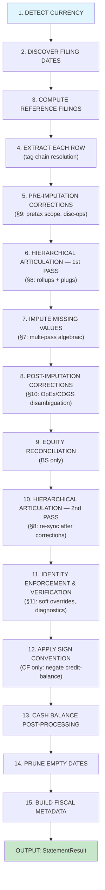

# Standardized Financial Statement Extraction from SEC XBRL Data

## A Technical Whitepaper

---

## Abstract

This document is a methodology and maintenance specification for a system
that transforms raw SEC XBRL Company Facts data into standardized,
cross-validated financial statements. It is written for readers who need to
evaluate the design without reading the code and for maintainers who need a
repeatable framework for evolving the schema as taxonomies and filer behavior
change.

The system maps 1,190 distinct XBRL tag-namespace pairs into 250 standardized
line items across three financial statements and four company types. It
resolves tag evolution across 15 years of taxonomy vintages, derives missing
values through algebraic imputation, applies targeted corrections for known
XBRL scope-mismatch patterns, enforces curated accounting identities, and
produces consistent time-series data from 2009 to present. For monetary
quarterly duration items, Q4 is reconstructed from the audited annual total
minus reported interim quarters because standalone Q4 values are generally
not available in SEC Company Facts.

The paper's core claim is methodological rather than promotional: the system
enforces strict identity resolution logic, currently achieving zero
unresolved violations across a curated, edge-case-weighted validation corpus
of 970 company histories.  This result reflects the defined verification
set and documented
tolerance; it is not a claim about all possible filers.  The corpus spans
industrials, banks, insurers, conglomerates, REITs, discontinued-operations
cases, fiscal-year offsets, IFRS filers, and multi-CIK histories.

The system is organized into a Python package and a set of JSON schema
files, supported by a public API layer and a taxonomy maintenance tool:

- **`statement_schema/schemas/`** — The declarative schema, split into four
  JSON files: `_meta.json` (metadata, detection signals), plus one file per
  statement — `income_statement.json`, `balance_sheet.json`, `cash_flow.json`
  (~950 KB in total).
- **`statement_schema/`** — The runtime engine package: `_types.py`
  (dataclasses, constants), `_detection.py` (company-type classification,
  filing dates, fiscal metadata), `_extraction.py` (row-level XBRL
  extraction, reference filing computation), `_rules.py` (imputation and
  verification rule definitions), `_imputation.py` (multi-pass imputation,
  hierarchical articulation, identity enforcement), `_schema.py`
  (`StatementSchema` class orchestrating the pipeline), and `__init__.py`.
- **`company_facts.py`** — The public API: wraps the engine, merges
   configured multi-CIK histories, and produces long-format records with full
   provenance per line item per period.
- **`xbrl_taxonomy_helper.py`** — Taxonomy infrastructure: programmatic
  access to FASB, SEC, and IFRS Foundation taxonomies for schema maintenance.

## Reader Orientation

This whitepaper is written for two primary audiences:

1. **Methodology reviewers** who want to understand the extraction logic,
   validation logic, and accounting assumptions without reading the code.
2. **Schema maintainers** who need a conceptual framework for evolving tag
   chains, row definitions, correction rules, and taxonomy coverage over time.

The paper therefore emphasizes methodological decisions, validation logic,
and maintenance-relevant structure rather than a line-by-line description of
the implementation. It explains how the system chooses among competing XBRL
facts, when it derives values algebraically, when it refuses to overwrite
direct facts, and how it uses a validation corpus to discover and resolve
known failure patterns.

The paper does **not** attempt to serve as a full API reference or as a
substitute for the source code. Readers who need callable signatures,
parameter defaults, or packaging details should consult the implementation.
The goal here is different: document the system's methodological contract so
that the design can be evaluated, maintained, and extended as taxonomies and
filers evolve.

## Claims, Guarantees, and Non-Guarantees

The system is designed to provide a reproducible transformation from raw SEC
Company Facts data to standardized statement rows with full provenance. Its
claims are strongest where the output is anchored to direct XBRL facts and
validated accounting identities, and weaker where the source data itself is
structurally incomplete or scope-ambiguous.

### Methodological Guarantees

| Property | Guarantee | Boundary / Consequence |
|----------|-----------|------------------------|
| Standardized row naming | Every output row is mapped to a stable, schema-defined snake_case tag. | Row names are invariant across filers even when underlying XBRL tags differ. |
| Provenance | Every non-null output value carries a source string describing whether it was extracted, imputed, corrected, reconciled, or reconstructed. | Downstream users can distinguish direct facts from derived values. |
| Filing-vintage consistency | Within `extract_all`, the system uses a shared reference filing map across IS, BS, and CF. | Consistency is prioritized over maximal row coverage; some dates may be dropped during alignment. |
| Identity enforcement policy | Soft values may be overridden to satisfy accounting identities; hard XBRL facts are not silently overwritten when both sides disagree. | Genuine hard-value conflicts surface as diagnostics rather than being hidden. |
| Quarterly monetary reconstruction | For monetary duration items, Q4 is reconstructed as `FY - (Q1 + Q2 + Q3)`. | This is a methodological requirement, not an optional normalization step, because standalone Q4 duration facts are typically absent from SEC Company Facts. |
| Sparse output semantics | Null-valued rows are omitted from the final long-format output. | The output is intentionally sparse; absence means either no fact was available, the concept was not applicable, or no defensible derivation path existed. |

### Non-Guarantees

The system does **not** guarantee that every raw Company Facts entry will
appear in the standardized output, that every period-end date in one
statement will survive cross-statement alignment, or that every reported zero
is economically meaningful. It also does not claim that a zero-diagnostics
result means the source filing is free from disclosure ambiguity; it means
that every **testable identity included in the verification set** held within
tolerance after the documented correction and enforcement pipeline ran.

The system likewise does not treat apparent direct Q4 values for monetary
duration items as authoritative. For SEC annual filings, the reliable fact is
the full-year audited duration total; Q4 is ordinarily recovered by
subtracting reported interim quarters from that annual total. Shares and
per-share metrics are explicitly excluded from this additive reconstruction
because they do not aggregate across quarters in the same way as monetary
flows.

---

## Table of Contents

- [Reader Orientation](#reader-orientation)
- [Claims, Guarantees, and Non-Guarantees](#claims-guarantees-and-non-guarantees)
- [1. The Problem](#1-the-problem)
- [2. Data Sources & External References](#2-data-sources--external-references)
- [Validation Corpus and Evaluation Design](#validation-corpus-and-evaluation-design)
- [3. Schema Architecture](#3-schema-architecture)
- [4. Company Type Classification](#4-company-type-classification)
- [5. Tag Chain Resolution](#5-tag-chain-resolution)
- [6. Extraction Methodology](#6-extraction-methodology)
- [7. Imputation Methodology](#7-imputation-methodology)
- [8. Hierarchical Articulation](#8-hierarchical-articulation)
- [9. Pre-Imputation Corrections](#9-pre-imputation-corrections)
- [10. Post-Imputation Corrections](#10-post-imputation-corrections)
- [11. Identity Enforcement & Verification](#11-identity-enforcement--verification)
- [12. Scope Mismatch Resolution](#12-scope-mismatch-resolution)
- [13. Quarterly Methodology & Q4 Reconstruction](#13-quarterly-methodology--q4-reconstruction)
- [14. Final Output Format](#14-final-output-format)
- [15. Zero-Value and Null-Value Policy](#15-zero-value-and-null-value-policy)
- [16. Schema Maintenance Workflow](#16-schema-maintenance-workflow)
- [17. Reconstructing the Schema from Scratch](#17-reconstructing-the-schema-from-scratch)
- [18. Taxonomy Maintenance](#18-taxonomy-maintenance)

---

## 1. The Problem

### 1.1 XBRL Tag Proliferation

SEC filers report financial data using XBRL (eXtensible Business Reporting
Language). Each value is tagged with an element name from a taxonomy —
primarily US GAAP or IFRS. The fundamental problem is three-dimensional:

**Tag evolution over time.** FASB publishes a new US GAAP taxonomy annually.
Tags are introduced, deprecated, and renamed. Revenue was reported as
`SalesRevenueNet` (pre-2018), then
`RevenueFromContractWithCustomerExcludingAssessedTax` (ASC 606, 2018+), with
the broader `Revenues` available throughout. A single company's revenue
history may span multiple tags across filing vintages.

**Tag variation across filers.** Two companies reporting the same economic
concept may choose different XBRL tags. One company uses
`CostOfGoodsAndServicesSold`, another uses `CostOfRevenue`, a third uses
`CostOfGoodsSold`. All represent cost of revenue. IFRS filers use entirely
different tags: `Revenue` instead of `Revenues`, `ProfitLoss` instead of
`NetIncomeLoss`.

**Structural variation across industries.** Banks report Net Interest Income
and Provision for Credit Losses — concepts that don't exist for industrial
companies. Insurance companies report Premium Revenue and Policyholder
Benefits. A single statement template cannot serve all filer types.

### 1.2 Scope Ambiguity

Beyond tag selection, XBRL introduces scope ambiguity — the same economic
concept can be reported at different levels of consolidation:

- **`ProfitLoss`** includes noncontrolling interests (NCI); **`NetIncomeLoss`**
  excludes NCI (parent-only). Both are commonly used for "net income."
- **`IncomeLossFromContinuingOperationsBeforeIncomeTaxes...`** has variants
  that exclude equity-method investment income and variants that include it.
- Cash flow activity totals may use `ContinuingOperations`-scoped tags
  while the net change tag covers total operations.
- Tags evolved from a "cash and cash equivalents" basis to a "cash,
  restricted cash, and restricted cash equivalents" basis circa 2017.

These scope mismatches are invisible when looking at a single tag in
isolation but cause accounting identities to fail when tags of different
scope are combined. A significant portion of this system's complexity exists
to detect and resolve these mismatches.

### 1.3 The SEC Company Facts API

The SEC provides a bulk data endpoint for every filer:

```
https://data.sec.gov/api/xbrl/companyfacts/CIK{cik_padded}.json
```

This returns every XBRL tag the company has ever reported, organized by
namespace → tag name → unit type → array of entries. Each entry contains:

```json
{
  "end": "2024-09-28",
  "val": 391035000000,
  "accn": "0000320193-24-000123",
  "fy": 2024,
  "fp": "FY",
  "form": "10-K",
  "filed": "2024-11-01",
  "frame": "CY2024Q4I",
  "start": "2023-10-01"
}
```

The extraction challenge: given this raw data for any company, produce
standardized financial statements with consistent row names, correct signs,
no double-counting, complete time series, algebraic derivation of missing
values, and verified accounting identities — all with full provenance
tracking for every value.

---

## 2. Data Sources & External References

### 2.1 Primary Data Sources

| Source | URL Pattern | What It Provides |
|--------|-------------|------------------|
| SEC Company Facts API | `https://data.sec.gov/api/xbrl/companyfacts/CIK{cik}.json` | All historical XBRL tag values for a filer |
| SEC EDGAR Taxonomies Index | `https://www.sec.gov/info/edgar/edgartaxonomies.xml` | Master index of all recognized taxonomies and versions |

### 2.2 Taxonomy Schema Sources

| Taxonomy | Host | URL Pattern | Years |
|----------|------|-------------|-------|
| US GAAP | FASB | `https://xbrl.fasb.org/us-gaap/{year}/` | 2011–2026 |
| SEC Reporting (SRT) | FASB | `https://xbrl.fasb.org/srt/{year}/` | 2011–2026 |
| Document & Entity (DEI) | SEC | `https://xbrl.sec.gov/dei/{year}/` | 2011–2026 |
| IFRS Full | IFRS Foundation | `https://xbrl.ifrs.org/taxonomy/{YYYY-MM-DD}/` | 2020–2025 |

#### Key Taxonomy Files (US GAAP)

For any given year, the US GAAP taxonomy contains:

```
https://xbrl.fasb.org/us-gaap/{year}/
├── elts/
│   ├── us-gaap-{year}.xsd              # Schema: all element definitions
│   └── us-gaap-lab-{year}.xml          # Labels: human-readable names
└── stm/
    ├── us-gaap-stm-sfp-classified-pre-{year}.xml   # Presentation: Balance Sheet
    ├── us-gaap-stm-soi-pre-{year}.xml               # Presentation: Income Statement
    ├── us-gaap-stm-scf-indirect-pre-{year}.xml      # Presentation: Cash Flow
    └── ... (83 total components including disclosures)
```

The schema file defines every element's `name`, `type` (monetary, per-share,
shares), `periodType` (duration or instant), `balance` (debit or credit),
and whether it is abstract. The presentation linkbase files define the
hierarchical layout of standard financial statements.

#### IFRS Taxonomy

IFRS uses date-based versioning (e.g., `2025-03-27`). Date strings are
resolved by parsing SEC's `edgartaxonomies.xml` for IFRS Foundation href
entries, with a hardcoded fallback table for 2020–2025.

### 2.3 Imputation & Validation References

| Source | What It Provides |
|--------|------------------|
| **FASB Presentation Linkbases** | Hierarchical statement structures: parent-child nesting, display order |
| **FASB Calculation Linkbases** | Algebraic relationships between elements (weights of +1 or −1) |
| **xbrlsite Report Frame** | Standardized statement templates, company type classifications, and ImputeRules — algebraic identities between line items organized by company type. The imputation rules in this system are derived from these ImputeRules. |
| **SEC Company Facts (validation corpus)** | 970 company histories used to verify extraction correctness, tag chain quality, and identity compliance |

---

## Validation Corpus and Evaluation Design

The system's headline validation claim is not based on a random sample of SEC
filers. It is based on a deliberately curated corpus intended to stress the
methodology across the kinds of reporting patterns that break naive XBRL
extraction systems: taxonomy transitions, industry-specific statement
structures, non-December fiscal year-ends, multi-CIK continuity, scope
mismatches, discontinued operations, mezzanine equity, and IFRS reporting.

The validation corpus contains **970 companies** spanning four company types:
619 industrial, 231 diversified, 68 financial, and 52 insurance. Coverage
is near-complete for the Russell 1000 index. Industrial issuers provide long
XBRL histories and frequent taxonomy transitions; banks and insurers require
distinct statement templates; conglomerates and special cases expose scope
ambiguities and classification edge cases that simpler filers do not.

The evaluation protocol has four layers:

1. **Automated extraction validation.** Each issuer is run through the full
   annual and quarterly extraction pipeline using the same schema and rule
   set described in this paper.
2. **Deterministic unit and regression tests.** The dedicated test module
   `openbb_platform/providers/sec/tests/test_company_facts.py` exercises the
   extraction engine against both synthetic fixtures and a real SEC Company
   Facts fixture for BlackRock. These tests assert company-type detection,
   tag-chain priority, imputation cascades, suspect-zero labeling, Q4
   reconstruction, balance-sheet immunity from Q4 derivation, cross-vintage
   fallback behavior, IFRS namespace handling, multi-CIK merging,
   cross-statement identity locks, and diagnostic emission. They therefore
   function as executable evidence for known failure modes, not merely as
   convenience checks.
3. **Identity validation.** The resulting statements are checked against the
   verification identities documented in Section 11. The target outcome is
   zero unresolved `ValidationWarning` diagnostics after the correction and
   enforcement pipeline completes.
4. **Manual reasonableness review.** Key totals such as revenue, net income,
   total assets, operating cash flow, and net change in cash are spot-checked
   against SEC filings across multiple periods, with special attention paid
   to periods near taxonomy transitions or known scope-mismatch events.

The unit-test layer matters because corpus-level zero-diagnostic outcomes do
not by themselves prove that the correct causal path produced a result. The
tests encode narrower behavioral claims: that a specific tag wins when two
plausible tags coexist, that an imputed subtotal carries the expected
provenance string, that Q4 is reconstructed only for monetary duration facts,
and that known historical edge cases continue to behave the same way after
maintenance changes. In other words, the test suite turns prior debugging and
issuer-specific discoveries into durable, executable evidence.

The validation design can be summarized compactly as follows:

| Dimension | Current Coverage | Why It Matters |
|-----------|------------------|----------------|
| Corpus size | 970 companies | Near-complete Russell 1000 coverage across all four company types. |
| Company types | 619 industrial, 231 diversified, 68 financial, 52 insurance | Ensures the methodology is tested across all four statement templates with substantial depth in each category. |
| Frequencies tested | Annual, quarterly, semi-annual | Validates both direct annual extraction and interim reconstruction behavior, including Q4 and H1/H2 derivation. |
| Validation modes | Automated extraction, deterministic unit/regression tests, identity verification, manual spot-checks | Combines end-to-end extraction checks, executable edge-case assertions, mechanical identity verification, and human review of key totals in SEC filings. |
| Edge-case coverage | Taxonomy transitions, non-December fiscal year-ends, discontinued operations, mezzanine equity, multi-CIK continuity, IFRS filers, insurance variants, REITs | Focuses the corpus on the cases most likely to break naive XBRL standardization. |
| Success criterion | Zero unresolved `ValidationWarning` diagnostics for the verification set | The system must clear every documented identity check after correction and enforcement logic has been applied. |

The corpus is **comprehensive within the Russell 1000 universe**, answering
both the methodological question, "Does the system handle filers that report
the same concept in structurally different ways?" and the broader coverage
question, "Does it handle the full range of large-cap U.S. reporting without
modification?" The hard part of maintenance is not the median filer; it is the
tail of unusual filers that force new tag-chain entries, new safeguards, or
new correction logic. The validation report clears both annual and quarterly
runs with zero diagnostics across all 970 companies.

Appendix B enumerates representative members of the corpus and the edge cases
they cover. The corpus includes, among others, Apple for long-tag-chain
industrial history, JPMorgan for bank-specific revenue structure,
UnitedHealth for insurance-specific reporting and disposal-group cash flow,
Berkshire Hathaway and BlackRock for diversified structures, Boeing for
NCI-related net-income scope issues, and Disney and Merck for discontinued
operations cash flow patterns. The claim of zero unresolved identity
violations is therefore best interpreted as a claim about a **deliberately
challenging validation set**, not merely about straightforward issuers.

---

## 3. Schema Architecture

### 3.1 The Declarative Schema (`statement_schema/schemas/`)

The schema is split across four JSON files in `statement_schema/schemas/`:

```
statement_schema/schemas/
├── _meta.json              # version, generated, taxonomy_sources, detection signals
│   ├── version: "2.0"
│   ├── generated: "2026-03-17"
│   ├── taxonomy_sources
│   │   ├── us_gaap: { years: [2011, 2026], tags_indexed: 3753 }
│   │   └── ifrs: { years: [2020, 2025], tags_indexed: 3979 }
│   └── detection
│       ├── insurance_is_signals: [8 tags]
│       ├── insurance_bs_signals: [5 tags]
│       ├── financial_signals: [16 tags]
│       ├── industrial_signals: [5 tags]
│       ├── diversified_signals: [5 tags]
│       └── min_financial_signals: 2
├── income_statement.json   # {industrial: [55 rows], financial: [74 rows],
│                           #  diversified: [52 rows], insurance: [56 rows]}
├── balance_sheet.json      # {industrial: [73 rows], financial: [68 rows],
│                           #  diversified: [73 rows], insurance: [68 rows]}
└── cash_flow.json          # {industrial: [57 rows], financial: [62 rows],
                            #  diversified: [57 rows], insurance: [62 rows]}
```

**3 statements × 4 company types = 12 arrays, totaling 761 row instances
mapping to 250 unique standardized tags across 1,190 unique XBRL tag-namespace
pairs.**

### 3.2 Row Definition

Each row defines a standardized line item:

```json
{
  "tag": "total_gross_profit",
  "label": "Total Gross Profit",
  "description": "Aggregate revenue less cost of goods and services sold...",
  "parent": null,
  "sequence": 8,
  "factor": "+",
  "balance": "credit",
  "unit": "monetary",
  "period_type": "duration",
  "xbrl_tags": [
    { "tag": "GrossProfit", "namespace": "us-gaap" },
    { "tag": "GrossProfit", "namespace": "ifrs-full", "first_year": 2020, "last_year": 2025 }
  ]
}
```

| Field | Purpose |
|-------|---------|
| `tag` | Stable snake_case identifier. Invariant across schema versions. |
| `label` | Display name for rendered statements. |
| `parent` | The tag this row rolls up into (tree structure). `null` = root. |
| `sequence` | Display order (1-based, unique within each company-type array). |
| `factor` | `"+"` adds to parent, `"-"` subtracts from parent, `"0"` supplemental. |
| `balance` | XBRL `"debit"` or `"credit"`. Governs sign convention. |
| `unit` | `"monetary"`, `"per_share"`, or `"shares"`. |
| `period_type` | `"duration"` (flow) or `"instant"` (point-in-time snapshot). |
| `xbrl_tags` | **Ordered priority chain** of XBRL tags to try during extraction. |

### 3.3 The Runtime Engine (`statement_schema/`)

The runtime engine is a Python package comprising seven modules.
The `StatementSchema` class in `_schema.py` is the primary entry point,
loaded once at module import and reused for all calls. Its methods
delegate to module-level functions in `_detection.py` (company-type
classification, filing dates, fiscal metadata), `_extraction.py`
(row-level value extraction, reference filing computation),
`_imputation.py` (imputation, articulation, identity enforcement), and
`_rules.py` (pure-data rule definitions). Dataclasses and constants
live in `_types.py`, and `__init__.py` re-exports all public names
for backward-compatible imports.

| Method | Purpose |
|--------|---------|
| `detect_type(facts)` | Classify a company as industrial / financial / diversified / insurance |
| `extract(facts, statement, ...)` | Extract one statement → `StatementResult` |
| `extract_all(facts, ...)` | Extract all three statements with aligned dates and shared filing vintage |
| `get_filing_dates(facts, frequency)` | Discover valid period-end dates |
| `get_fiscal_meta(facts, frequency, dates)` | Build fiscal year/period metadata per date |
| `merge_facts(*facts_list)` | Merge multiple CIKs' Company Facts (e.g., BlackRock's CIK transition) |

### 3.4 The Public API (`company_facts.py`)

| Function | Purpose |
|----------|---------|
| `resolve_company_facts(facts_json, fiscal_years=None, period="both", pit_mode=False, include_preliminary=False)` | Synchronous: parse SEC JSON → `StandardizedStatements` |
| `get_standardized_financials(symbol=None, cik=None, fiscal_years=None, period="both", use_cache=True, pit_mode=False, include_preliminary=False)` | Async: fetch from SEC API, merge multi-CIK histories when configured, then resolve |

`StandardizedStatements` is the public container returned by the resolver. It
holds entity metadata (`entity_name`, `cik`, `company_type`, `currency`),
three long-format record lists (one per statement), and an aggregated
`diagnostics` list containing the `ValidationWarning` objects emitted during
statement extraction. The `period` argument accepts `annual`, `quarterly`,
or `both`; when `both` is requested, the resolver appends records from each
frequency and distinguishes them via a `frequency` field in the final output.

### 3.5 Key Dataclasses (`_types.py`)

The following dataclasses are defined in `statement_schema/_types.py` and
re-exported via `__init__.py`:

```python
@dataclass
class RowResult:
    tag: str                        # Standardized tag name
    label: str                      # Display label
    description: str                # Long-form schema description
    parent: str | None              # Parent tag (None = root)
    sequence: int | float           # Display order (plugs may be fractional)
    factor: str                     # "+", "-", or "0"
    balance: str                    # "debit" or "credit"
    unit: str                       # "monetary", "per_share", or "shares"
    values: dict[str, float]        # {period_end_date: value}
    sources: dict[str, str]         # {date: provenance string}
```

```python
@dataclass
class StatementResult:
    statement: str                   # "income_statement", "balance_sheet", "cash_flow"
    company_type: str                # "industrial", "financial", etc.
    frequency: str                   # "annual" or "quarterly"
    currency: str                    # ISO code (e.g., "USD")
    dates: list[str]                 # Sorted period-end dates
    rows: list[RowResult]            # Extracted line items
    fiscal_data: dict[str, dict]     # {date: {fiscal_year, fiscal_period}}
    diagnostics: list[ValidationWarning]
```

```python
@dataclass
class ValidationWarning:
    date: str         # Period-end date of the discrepancy
    tag: str          # Standardized tag whose value disagrees
    expected: float   # Value computed from the accounting identity
    actual: float     # Value extracted from XBRL
    formula: str      # Human-readable formula
    identity: str     # Full identity description
```

The `diagnostics` list on `StatementResult` surfaces any accounting-identity
discrepancies that survive the full verification pipeline. An empty list
means every testable identity held within tolerance for every period.

#### Source Provenance Strings

The `sources` field tracks exactly how every value was obtained:

| Source Pattern | Meaning |
|----------------|---------|
| `us-gaap:Revenues` | Direct XBRL extraction at reference filing date |
| `us-gaap:Revenues(fallback)` | Cross-vintage extraction from a non-reference filing |
| `imputed: total_revenue + -total_cost_of_revenue` | Algebraic imputation from accounting identity |
| `imputed-rollup: sum of explicitly mapped children` | Hierarchical parent rollup from children |
| `imputed-plug: balancing remainder` | Synthetic plug to maintain parent-child articulation |
| `identity-enforced: ...` | Value overridden during identity enforcement |
| `corrected: total_gross_profit - total_operating_income` | OpEx/COGS disambiguation |
| `us-gaap:NetIncomeLoss(NCI-corrected)` | NI switched from NCI-inclusive to parent-only |
| `us-gaap:ProfitLoss(disc-adjusted)` | NI adjusted from total to continuing-ops scope |
| `us-gaap:NetIncomeLoss(identity_lock:cash_flow)` | Direct XBRL value locked to a cross-statement identity target |
| `reconciled: total_equity_and_nci - noncontrolling_interests` | Equity decomposition override |
| `Q4: FY − (Q1+Q2+Q3)` | Q4 derived from annual minus first three quarters |
| `H2: FY − H1` | H2 derived from annual minus first-half semi-annual filing |
| `derived: cash_at_end_of_period(2023-09-30)` | Beginning cash derived from prior period's ending |
| `standalone` | Extracted without filing-date constraint |
| `imputed-zero: ...` | Suspect zero flagged for review |

---

## 4. Company Type Classification

### 4.1 The Classification Problem

Financial statements have fundamentally different structures depending on
industry:

- **Industrial** (Apple, Chevron, Coca-Cola): Revenue → COGS →
  Gross Profit → OpEx → Operating Income. Balance sheet uses
  current/noncurrent classification.

- **Financial** (JPMorgan, Goldman Sachs): Interest Income → Interest
  Expense → Net Interest Income → Noninterest Income → Provision for Credit
  Losses. Balance sheet uses asset-class structure (loans, deposits, etc.).

- **Insurance** (UnitedHealth): Premium Revenue → Benefits & Claims →
  Pretax Income. Balance sheet has policy liabilities, deferred acquisition
  costs, separate account assets.

- **Diversified** (Berkshire Hathaway, BlackRock, BHP): Revenue →
  Costs & Expenses → Operating Income. No gross profit decomposition
  because the cost structure doesn't split cleanly into COGS + SG&A.

### 4.2 Signal-Based Detection

Classification uses the XBRL tags actually present in a company's data,
not SIC/NAICS codes. The priority cascade:

```
1. INSURANCE  — ≥ 1 insurance IS signal AND (IS + BS signals) ≥ 2
   (defers to financial when financial signal count is higher)
2. FINANCIAL  — ≥ 2 financial signals
3. INDUSTRIAL — any COGS or GrossProfit tag present **in recent filings**
4. DIVERSIFIED — has CostsAndExpenses without COGS
5. INDUSTRIAL — ultimate fallback
```

**Insurance IS signals** (8): `PremiumsEarnedNet`, `PolicyholderBenefitsAndClaimsIncurredNet`,
`PolicyholderBenefitsAndClaimsIncurredHealthCare`, `BenefitsLossesAndExpenses`,
`InsuranceRevenue`, `InsuranceServiceResult`,
`InsuranceServiceExpensesFromInsuranceContractsIssued`, `NetEarnedPremium`

**Insurance BS signals** (5): `LiabilityForFuturePolicyBenefits`,
`DeferredPolicyAcquisitionCosts`, `InsuranceContractsThatAreLiabilities`,
`LiabilitiesArisingFromInsuranceContracts`, `UnearnedPremiums`

**Financial signals** (need ≥2, 16 total): `InterestIncomeExpenseNet`, `NoninterestIncome`,
`ProvisionForLoanAndLeaseLosses`, `NetInterestIncome`,
`InterestAndDividendIncomeOperating`,
`FederalFundsSoldAndSecuritiesPurchasedUnderAgreementsToResell`,
`FinancingReceivableExcludingAccruedInterestBeforeAllowanceForCreditLoss`,
`InterestRevenueCalculatedUsingEffectiveInterestMethod`,
`FinancialAssetsAtAmortisedCost`, `DepositsFromBanks`,
`ReverseRepurchaseAgreementsAndCashCollateralOnSecuritiesBorrowed`,
`SubordinatedLiabilities`, `InterestIncomeOnLoansAndReceivables`,
`CreditrelatedFeeAndCommissionIncome`, `TradingIncomeExpense`,
`BankAcceptanceAssets`

**Industrial signals** (5): `CostOfGoodsAndServicesSold`, `CostOfRevenue`,
`CostOfGoodsSold`, `GrossProfit`, `CostOfSales`

**Diversified signals** (5): `CostsAndExpenses`, `OperatingIncomeLoss`,
`OperatingExpense`, `ProfitLossFromOperatingActivities`,
`OtherOperatingIncomeExpense`

The detection signal lists now include both US GAAP and IFRS tag names to
ensure correct classification for foreign private issuers reporting under
IFRS.

#### 4.2.1 Recency-Aware Industrial Detection

Industrial signals (COGS/GrossProfit tags) must have data in a **recent
10-K filing** (within the last 5 years) to trigger industrial classification.
This prevents stale tags from overriding the correct classification. For
example, Equity Residential reported `GrossProfit` in 2010 but stopped using
it by 2011. Without the recency check, the 15-year-old tag would trigger the
industrial template, which then derives phantom COGS values (via
`CostsAndExpenses − OperatingExpenses`) and produces nonsensical negative
gross profit figures. With the recency check, EQR correctly classifies as
diversified.

The recency check is implemented via `_has_recent_data()`, which scans the
raw Company Facts entries for 10-K/20-F filings with an `end` date within
the cutoff window. Only industrial signals require this check — insurance
and financial signals are structural to the company type and do not exhibit
the same stale-tag pattern.

---

## 5. Tag Chain Resolution

### 5.1 The Priority Chain

Each standardized row contains an ordered array of XBRL tags to try during
extraction. This ordering encodes institutional knowledge:

```json
"xbrl_tags": [
  { "tag": "RevenueFromContractWithCustomerExcludingAssessedTax", "namespace": "us-gaap" },
  { "tag": "Revenues", "namespace": "us-gaap", "first_year": 2011, "last_year": 2026 },
  { "tag": "SalesRevenueNet", "namespace": "us-gaap", "first_year": 2011, "last_year": 2017 },
  { "tag": "Revenue", "namespace": "ifrs-full", "first_year": 2020, "last_year": 2025 }
]
```

**Priority rules:**

1. **Most specific first.** The ASC 606 revenue tag (excludes sales tax) is
   preferred over the broad `Revenues` catch-all.
2. **Current before deprecated.** Active taxonomy tags before those with
   `last_year` set.
3. **US GAAP before IFRS.** Most SEC filers use US GAAP; IFRS equivalents
   are appended as fallbacks for foreign private issuers (20-F filers).
4. **Year bounds are documentation, not filters.** The engine tries all tags
   regardless — Company Facts data itself is absent for out-of-range years.

### 5.2 Resolution Algorithm

For each standardized row and each period-end date, the engine walks the
chain in priority order. The first tag that has data matching the period-end
date and the reference filing date is selected. **First hit wins.**

If no tag has data at the reference filing date, the engine tries the
nearest alternative filing (preferring earlier filings). Values sourced this
way are marked with a `(fallback)` suffix — e.g., `us-gaap:Revenues(fallback)`.
This provenance marker is used downstream by the identity enforcement system
to recognize cross-vintage values (Section 11.4).

### 5.3 Chain Statistics

The two revenue rows (`operating_revenue` and `total_revenue`) have
82-entry tag chains covering every revenue-related XBRL tag across all
taxonomy years, industry-specific variants, and IFRS equivalents.
`cash_at_beginning_of_period` has zero XBRL entries — it is always derived
from the prior period's ending balance. Most rows have 1–4 candidates.
Across all 761 row instances: 2,022 `us-gaap` tag references and 1,834
`ifrs-full` tag references.

---

## 6. Extraction Methodology

### 6.1 Filing-Date Consistency

The most important invariant: **all rows in a statement are extracted from
the same filing vintage for each period.**

When a company files a 10-K, all values in that filing are internally
consistent. If the company later files a 10-K/A (amendment), some values may
be restated. The engine prevents mixing original and restated values by
computing a **reference filing date** per period — the latest filing date
that provides data for any row across *all three statements*.
Using the latest filing ensures that restatements and amendments are
reflected in the output:

```python
ref_filed_map = compute_ref_filings(facts, rows_def, frequency, currency)
# {period_end_date: latest_filing_date_with_data}
```

When called via `extract_all`, a single shared reference filing map is
computed across all rows from IS, BS, and CF, ensuring that net income on
the income statement matches net income on the cash flow statement.

**450-day filing cap.** In default (non-PIT) mode, the engine ignores any
filing whose `filed` date is more than 450 days after the `end` date.
This prevents stale re-filings (e.g., a late 10-K/A filed years after the
period) from overriding the substantive filing vintage. The cap does not
apply in `pit_mode`, where the earliest filing is selected regardless.

**Form categories.** The engine groups SEC form types into four constants:

| Constant | Forms |
|----------|-------|
| `ANNUAL_FORMS` | 10-K, 10-K/A, 20-F, 20-F/A, 40-F, 40-F/A |
| `QUARTERLY_FORMS` | 10-Q, 10-Q/A |
| `SEMI_ANNUAL_FORMS` | 6-K, 6-K/A |
| `PRELIMINARY_FORMS` | 8-K, 8-K/A |

Annual extraction considers only `ANNUAL_FORMS` by default. Quarterly and
semi-annual extraction considers all non-preliminary forms. Preliminary
forms (8-K filings) are excluded by default because they may contain
unaudited, incomplete, or press-release-grade figures.

**`include_preliminary` parameter.** Both API functions accept
`include_preliminary=True`, which adds `PRELIMINARY_FORMS` to the set of
allowed forms during reference filing computation. This is useful when an
issuer's only source of certain interim data is an 8-K (e.g., preliminary
earnings releases before the 10-Q is filed). The parameter does not affect
the extraction pipeline itself — it only widens the filing-date discovery
window.

### 6.2 Annual Extraction Pipeline

The full pipeline for a single statement extraction:



The same pipeline in text form:

```
INPUT: Company Facts JSON, statement name, company type

 1. DETECT CURRENCY
    Scan all unit keys; most frequent 3-letter ISO code wins (default: USD).

 2. DISCOVER FILING DATES
    Find period-end dates from 10-K/20-F/40-F forms with 300–400 day
    duration items. Deduplicate using the dominant fiscal-year-end
    month-day pattern. Drop earliest date if no Assets instant exists
    (incomplete early XBRL era).

 3. COMPUTE REFERENCE FILINGS
    Per period-end, find the LATEST filing date across ALL rows in
    ALL THREE statements (reflects restatements/amendments).

 4. EXTRACT EACH ROW
    Walk the xbrl_tags chain. First tag with data matching (end_date,
    ref_filing_date) wins. Fallback to nearest alternative filing if no
    match. Record provenance in sources dict.

 5. PRE-IMPUTATION CORRECTIONS (Section 9)
    Fix scope mismatches in pretax income and net income before imputation.

 6. HIERARCHICAL ARTICULATION — FIRST PASS (Section 8)
    Roll up parent nodes from children. Generate synthetic plugs where
    parent ≠ sum of children.

 7. IMPUTE MISSING VALUES (Section 7)
    Multi-pass algebraic derivation from accounting identities.

 8. POST-IMPUTATION CORRECTIONS (Section 10)
    OpEx disambiguation, COGS disambiguation, GP recalculation.

 9. EQUITY RECONCILIATION (BS only)
    Override total_equity when the XBRL decomposition of equity into
    parent + NCI is inconsistent with the total, but the top-level
    BS identity (L + E_nci + R_nci = L&E) holds.

10. HIERARCHICAL ARTICULATION — SECOND PASS (Section 8)
    Re-sync tree structure after corrections.

11. IDENTITY ENFORCEMENT & VERIFICATION (Section 11)
    Check all accounting identities. Override soft values to satisfy
    identities. Apply targeted corrections (NCI, disc ops). Emit
    diagnostics only for genuine hard-value mismatches.

12. APPLY SIGN CONVENTION (CF only)
    Negate credit-balance items so outflows are negative,
    except net_income family and supplemental disclosures.

13. CASH BALANCE POST-PROCESSING
    Standalone extraction fills gaps in cash_at_end_of_period.
    Begin-of-period derived as prior period's end-of-period.

14. PRUNE EMPTY DATES
    Remove dates where every row is NULL.

15. BUILD FISCAL METADATA
    Compute fiscal_year/fiscal_period per date from SEC fy/fp fields.
    Apply monotonicity correction for early XBRL era duplicates.

OUTPUT: StatementResult with dates, rows, currency, fiscal_data, diagnostics
```

### 6.3 Date Alignment in `extract_all`

When extracting all three statements via `extract_all`:

1. Compute a single shared reference filing map across IS, BS, CF.
2. Extract each statement individually.
3. **Intersect** the date sets — only dates present in all three statements
   are retained.
4. For quarterly: trim incomplete leading fiscal years.
5. Apply the aligned date set and unified fiscal metadata to all.

### 6.4 The Fiscal Year Field (`fy`) and Comparative-Data Duplication

The SEC `fy` field carries the fiscal year of the *filing*, not the *period*.
When Apple files a FY 2024 10-K, prior-year comparatives also carry
`fy=2024`. The same `end` date can appear with multiple `fy` values.

**Resolution:** `get_fiscal_meta()` selects the earliest `filed` date per
`end` date to get the original filing's `fy`. A monotonicity correction
walks backwards and decrements any `fy` ≥ the next date's — fixing the
first-ever XBRL filing case where historical comparatives all share one `fy`.

---

## 7. Imputation Methodology

### 7.1 Design Philosophy

Imputation exploits a fundamental property of double-entry accounting: if a
company reports 2 of 3 values in an accounting identity, the third can be
derived. The rules are drawn from the xbrlsite Report Frame's ImputeRules
and FASB's taxonomy calculation linkbases.

Each rule is a tuple: `(target_tag, [(source_tag, sign), ...])`.

The target is computed as: `target = Σ(source × sign)`.

A rule fires only when:
1. The target has no extracted value for the period
2. ALL source tags have values for the period

The **first applicable rule wins** for each target tag — if an identity is
satisfied by one rule, later rules for the same target are skipped.

### 7.2 Income Statement Rules

#### Industrial

| Target | = | Formula | Accounting Basis |
|--------|---|---------|-----------------|
| `total_cost_of_revenue` | = | `costs_and_expenses` − `total_operating_expenses` | C&E decomposition |
| `total_operating_expenses` | = | `costs_and_expenses` − `total_cost_of_revenue` | C&E decomposition |
| `costs_and_expenses` | = | `total_revenue` − `total_operating_income` | C&E = Rev − OpInc |
| `total_gross_profit` | = | `total_revenue` − `total_cost_of_revenue` | GP identity |
| `total_cost_of_revenue` | = | `total_revenue` − `total_gross_profit` | GP inverse |
| `total_operating_expenses` | = | `total_gross_profit` − `total_operating_income` | OpInc identity |
| `total_operating_income` | = | `total_gross_profit` − `total_operating_expenses` | OpInc inverse |
| `total_other_income` | = | `total_pretax_income` − `total_operating_income` | Below-the-line residual |

The C&E-based rules fire first because when `costs_and_expenses` is directly
reported (as many filers do), they can derive COGS even before GP is known.
This matters because `total_operating_expenses` is typically available from
hierarchical rollup of SG&A, D&A, and other children (Section 8), making
the C&E decomposition path available in the first imputation pass.

#### Diversified

| Target | = | Formula |
|--------|---|---------|
| `total_operating_income` | = | `total_pretax_income` − `total_other_income` |
| `total_operating_income` | = | `total_revenue` − `costs_and_expenses` |
| `costs_and_expenses` | = | `total_revenue` − `total_operating_income` |
| `total_other_income` | = | `total_pretax_income` − `total_operating_income` |

No gross profit decomposition — diversified companies report aggregate
costs rather than the COGS + SG&A split.

#### Financial

| Target | = | Formula |
|--------|---|---------|
| `total_interest_income` | = | `net_interest_income` + `total_interest_expense` |
| `net_interest_income_after_provision` | = | `net_interest_income` − `provision_for_credit_losses` |
| `total_revenue` | = | `net_interest_income` + `total_noninterest_income` |
| `total_revenue` | = | `total_pretax_income` + `total_noninterest_expense` |

Rule 3 handles cases like American Express pre-2015 where no direct revenue
tag was reported but NII and noninterest income were available. Rule 4 is a
deeper fallback (Goldman Sachs pre-2011) where revenue is derived from
pretax + opex.

#### Insurance

| Target | = | Formula |
|--------|---|---------|
| `total_pretax_income` | = | `total_revenue` − `benefits_costs_expenses` |
| `benefits_costs_expenses` | = | `total_revenue` − `total_pretax_income` |

#### Common (Applied to All Types)

| Target | = | Formula |
|--------|---|---------|
| `total_pretax_income` | = | `net_income_continuing` + `income_tax_expense` |
| `net_income_continuing` | = | `total_pretax_income` − `income_tax_expense` |
| `net_income` | = | `net_income_continuing` + `net_income_discontinued` |
| `comprehensive_income` | = | `CI_parent` + `CI_nci` |
| `CI_parent` | = | `comprehensive_income` − `CI_nci` |
| `CI_nci` | = | `comprehensive_income` − `CI_parent` |
| `income_tax_expense` | = | `income_tax_current` + `income_tax_deferred` |
| `income_tax_current` | = | `income_tax_expense` − `income_tax_deferred` |
| `income_tax_deferred` | = | `income_tax_expense` − `income_tax_current` |
| `total_pretax_income` | = | `income_before_equity_method` + `equity_method_investments` |
| `income_before_equity_method` | = | `total_pretax_income` − `equity_method_investments` |
| `net_income_to_noncontrolling_interest` | = | `net_income_nci_redeemable` + `net_income_nci_nonredeemable` |

### 7.3 Balance Sheet Rules

| Target | = | Formula | Notes |
|--------|---|---------|-------|
| `total_noncurrent_assets` | = | `total_assets` − `total_current_assets` | |
| `total_noncurrent_liabilities` | = | `total_liabilities` − `total_current_liabilities` | |
| `total_liabilities_and_equity` | = | `total_assets` | Accounting equation |
| `total_liabilities` | = | `L&E` − `E_nci` − `redeemable_nci` | With mezzanine (tried first) |
| `total_liabilities` | = | `L&E` − `E_nci` | Without mezzanine (fallback) |
| `total_equity_and_nci` | = | `total_equity` + `NCI` | |
| `total_equity` | = | `E_nci` − `NCI` | |
| `total_common_equity` | = | `total_equity` − `preferred_equity` | |
| `total_common_equity` | = | `total_equity` | When no preferred stock |
| `E_nci` | = | `total_equity` | When NCI not separately reported |
| `redeemable_nci` | = | `redeemable_nci_common` + `redeemable_nci_preferred` + `redeemable_nci_other` | Direct mezzanine breakdown |
| `redeemable_nci` | = | `L&E` − `L` − `E_nci` | Mezzanine from identity (e.g., BlackRock) |

### 7.4 Cash Flow Rules

| Target | = | Formula |
|--------|---|---------|
| `net_change_in_cash` | = | `operating` + `investing` + `financing` + `fx_effect` |
| `effect_of_exchange_rate_changes` | = | `net_change` − `operating` − `investing` − `financing` |
| `depreciation_and_amortization` | = | `depreciation_expense` + `amortization_expense` |

The FX derivation is common after companies switch to the
`...IncludingExchangeRateEffect` net-change tag, which embeds FX in the
total and eliminates the separate FX line item.

### 7.5 Multi-Pass Cascading

Rules execute in up to 10 passes. Example cascade for an industrial IS:

- Pass 1: `total_gross_profit` derived from revenue and COGS
- Pass 2: `total_operating_income` derived from the just-computed GP
- Pass 3: `total_other_income` derived from the just-computed OpInc

Early exit occurs on the first pass with no new derivations.

---

## 8. Hierarchical Articulation

### 8.1 The Parent-Child Tree

Schema rows define a tree structure via the `parent` and `factor` fields.
For example, `total_operating_expenses` is the parent node; `selling_general_and_admin`,
`depreciation_and_amortization`, `research_and_development`, etc. are its
children with `factor="+"`.

### 8.2 Bottom-Up Rollup and Plug Generation

Before imputation, the engine performs hierarchical articulation:

1. **Process deepest nodes first** (strict bottom-up traversal).
2. **If a parent has no value**: impute it as the sum of its children
   (weighted by each child's factor). Source: `"imputed-rollup"`.
3. **If a parent has a value that differs from the children sum beyond
   tolerance**: generate a synthetic `other_{parent_tag}` plug row equal to
   the difference. Source: `"imputed-plug"`.

This ensures the statement tree always articulates exactly. The plug rows
represent line items the company reports but may not tag individually in XBRL
(e.g., "other operating expenses" that aren't separately itemized).

### 8.3 Large Plug Diagnostics

Not all plugs indicate legitimate "other" items — some arise because the
schema doesn't map a company's custom extension tag. To surface potential
schema coverage gaps, the engine emits a `LARGE_PLUG` diagnostic when a plug
exceeds **20% of the parent's value**. These diagnostics appear in the
`ValidationWarning` list with identity `"LARGE_PLUG: {pct}% of {parent}"`.

Maintainers reviewing large-plug diagnostics should check whether:

- The company legitimately clumps remaining expenses into an untagged
  "Other" bucket (common for `other_operating_expenses`).
- The schema is missing a mapping for a company-specific extension tag
  (e.g., `CompanySpecificRAndDExpense`) that should be added to the tag
  chain for a standard row.

### 8.4 Why This Matters

Hierarchical rollup enables imputation paths that otherwise wouldn't fire.
For example, `total_operating_expenses` may not have a direct XBRL tag, but
if SG&A, D&A, and R&D are all extracted, the rollup computes OpEx — which
then allows the imputation rule `COGS = C&E − OpEx` to derive cost of
revenue in the first pass.

Articulation runs **twice**: once before imputation (to seed the rules) and
once after identity enforcement (to propagate any overrides back through
the tree).

---

## 9. Pre-Imputation Corrections

Before imputation rules fire, two targeted corrections fix known scope
mismatches that would otherwise propagate errors through the derivation chain.

### 9.1 Equity-Method Pretax Reclassification

**Problem:** Some filers use `IncomeLossFromContinuingOperationsBeforeIncomeTaxes`
`MinorityInterestAndIncomeLossFromEquityMethodInvestments` — a pretax tag
that **excludes** equity-method investment income. The corresponding net
income tag (`ProfitLoss`) **includes** equity-method income. This scope
mismatch means `Pretax ≠ NI + Tax`.

**Resolution:** When the narrow pretax tag is detected (via its source
string), the engine checks three cases:

1. **Narrow identity already holds** (`pretax = NI + tax` within tolerance):
   Both values share the same scope — no correction needed.
2. **NI comes from total-scope `ProfitLoss`**: Clear pretax so imputation
   derives it from `NI + tax`, maintaining scope consistency.
3. **Equity-method income is available**: Add `equity_method_investments` to
   pretax to broaden its scope. The narrow value is preserved as
   `income_before_equity_method`.

### 9.2 ProfitLoss Discontinued-Operations Adjustment

**Problem:** When `net_income_continuing` maps to the bare `ProfitLoss` tag,
the extracted value is total NI (including discontinued operations). But the
pretax identity `Pretax = NI_continuing + Tax` expects NI from continuing
operations only.

**Resolution:** When NI is sourced from `ProfitLoss` (not a continuing-ops
variant like `ProfitLossFromContinuingOperations`), and `net_income_discontinued`
has a nonzero value, subtract it:

```
NI_continuing = ProfitLoss − NI_discontinued
```

Source updated to `ProfitLoss(disc-adjusted)`.

**Critical guard:** This adjustment only fires when `income_tax_expense` also
uses a `ContinuingOperations`-scoped tag. If tax is total-scope, adjusting
NI to continuing scope while leaving tax at total scope would create a
*new* scope mismatch. In that case, both NI and tax remain total-scope and
the pretax identity holds as-is.

This guard resolved 7 identity failures (IBM, Merck, Honeywell) where
the original unguarded adjustment broke the NI/tax scope alignment.

---

## 10. Post-Imputation Corrections

### 10.1 Gross Profit Recalculation

When COGS was derived from C&E after the initial hierarchical rollup set GP
equal to Revenue (because COGS was missing at rollup time), GP is
recalculated as `Revenue − COGS` from the now-known COGS value, and
imputation re-runs to propagate the correction through downstream identities.

### 10.2 COGS Disambiguation

Some companies (e.g., Verizon 2015–2017) report a *narrow*
`CostOfGoodsSold` (product-only) while also reporting `CostsAndExpenses`
(total). When the narrow COGS + rollup OpEx doesn't account for C&E, the
engine overrides: `COGS = C&E − OpEx`.

Guards prevent false positives:
- Only triggers on direct XBRL values (not already-imputed ones)
- C&E must approximately equal `Revenue − OpInc` (within tolerance)
- Reported COGS + OpEx must be < 95% of C&E (confirming COGS is partial)

### 10.3 OpEx Disambiguation

Some companies (e.g., Caterpillar) report `OperatingExpenses` as the total
of all costs and expenses (including COGS), not just the SG&A/D&A expenses
below gross profit. The engine detects this when `OpEx > Gross Profit` and
corrects: `OpEx = GP − OpInc`. Source: `"corrected: total_gross_profit - total_operating_income"`.

### 10.4 Equity Reconciliation

When the XBRL decomposition of equity into parent + NCI is inconsistent with
the reported total, but the top-level BS identity (`L + E_nci + R_nci = L&E`)
holds within tolerance, the engine overrides:

```
total_equity = total_equity_and_nci − noncontrolling_interests
```

This handles companies like BlackRock where mezzanine classification
differences cause inconsistency in the sub-total tagging.

---

## 11. Identity Enforcement & Verification

### 11.1 The Three-Tier Approach

After imputation and corrections, the system runs a full identity
enforcement and verification pass. This is the most sophisticated part of
the pipeline and operates in three tiers:

1. **Soft-target enforcement**: If the target of an identity is a soft value
   (rollup, plug, fallback, or imputation-derived subtotal), override it.
   These values are less authoritative than direct XBRL facts.
2. **Targeted corrections**: Apply specific domain knowledge to resolve
   known patterns (NCI scope, discontinued operations, disposal groups).
3. **Hard diagnostics**: When no safe enforcement path exists, emit a
   `ValidationWarning`. The system never silently overwrites authoritative
   XBRL data merely to make an identity pass.

The implementation is slightly more selective than a generic "soft vs hard"
description suggests. Only a narrow set of source markers are treated as
algebraically replaceable components: `imputed-rollup`, `imputed-plug`, and
`(fallback)`. A broader set of target markers can be overridden as stale
identity targets; this broader set additionally includes `imputed:` values.
If exactly one source component is soft, the engine solves for that source
algebraically. If the cash-flow rule is ambiguous or a known scope mismatch
is in play, enforcement is skipped and the system falls back to diagnostic
selection logic.

### 11.2 Verification Rules

The verification rule sets are curated separately from imputation rules.
They include only identities that can be meaningfully checked without
creating circular overrides.

#### Income Statement (`_IS_VERIFY`)

| Identity | Why Checked |
|----------|-------------|
| `total_pretax_income = net_income_continuing + income_tax_expense` | Core tax bridge |
| `net_income_continuing = total_pretax_income − income_tax_expense` | Tax bridge inverse |
| `total_gross_profit = total_revenue − total_cost_of_revenue` | GP identity |
| `total_operating_income = total_gross_profit − total_operating_expenses` | OpInc identity |

**Excluded:** `net_income = net_income_continuing + discontinued`. The
`ProfitLoss` tag is the authoritative NI figure that ties to the cash flow
statement. The continuing + discontinued identity uses broader NCI-inclusive
tags that can disagree with `ProfitLoss` for companies with disc ops (3M,
Honeywell, J&J, Merck).

#### Balance Sheet (`_BS_VERIFY`)

| Identity | Why Checked |
|----------|-------------|
| `total_assets = total_liabilities_and_equity` | Fundamental equation |
| `E_nci = total_equity + NCI` | Equity decomposition |
| `total_equity = E_nci − NCI` | Equity inverse |
| `total_liabilities = L&E − E_nci − redeemable_nci` | With mezzanine |
| `total_liabilities = L&E − E_nci` | Without mezzanine (fallback) |

**Excluded:** Noncurrent derivations and common equity identity
(`StockholdersEquity` includes preferred equity in XBRL for many filers).

#### Cash Flow (`_CF_VERIFY`)

| Identity | Why Checked |
|----------|-------------|
| `net_change = operating + investing + financing + fx_effect` | CF identity with FX |
| `net_change = operating + investing + financing` | CF identity without FX |
| `net_change = operating + investing + financing + fx_effect + other_net_changes` | CF identity with FX and other (e.g. Ferrovial business-acquisition cash) |
| `net_change = operating + investing + financing + other_net_changes` | CF identity without FX, with other |

Four rules compete based on the net-change tag (Section 11.5) and the
presence of reconciling items outside the standard activity buckets. D&A
decomposition is excluded because `DepreciationDepletionAndAmortization`
includes depletion while `Depreciation + Amortization` does not.

#### Cash Balance Verification

In addition to the rule-based identities above, a separate cash balance
post-processing step verifies:

```
cash_at_end_of_period = cash_at_beginning_of_period + net_change_in_cash
```

This identity is enforced directly during cash balance post-processing
(Section 6.2, step 13) rather than through `_CF_VERIFY`. When the identity
fails, the engine attempts to override soft components (beginning-of-period
values derived from the prior period's ending balance, or net-change values
from imputation) to satisfy the constraint. Genuine mismatches are surfaced
as diagnostics.

### 11.3 Tolerance

Identity checks use a **scale-adaptive tolerance** (`_tolerance()`).
The threshold is **0.1% of the largest absolute value** among the identity
components, floored at **$100,000** and capped at **$1,000,000**:

```python
_TOLERANCE_FLOOR = 100_000
_TOLERANCE_CAP   = 1_000_000

def _tolerance(*values):
    scale = max(abs(v) for v in values if v is not None)
    return max(_TOLERANCE_FLOOR, min(_TOLERANCE_CAP, scale * 0.001))
```

This accommodates SEC filing conventions where values are rounded to
millions or thousands, while avoiding false passes on small-cap companies
whose totals are closer to the floor.

### 11.4 Soft Value System

The enforcement logic classifies every value's provenance as "soft" or
"hard" using marker strings in the source field:

**Source-soft markers** (unreliable — can be overridden when they are a
component of an identity):
- `"imputed-rollup"` — parent computed from children sum
- `"imputed-plug"` — synthetic balancing remainder
- `"(fallback)"` — cross-vintage extraction

**Target-soft markers** (can be overridden as the *target* of an identity):
- All source-soft markers, plus:
- `"imputed:"` — imputation-derived values are stale if inputs changed

When an identity fails:

1. **Target is soft?** Override target with identity-computed value.
   Source: `"identity-enforced: ..."`.
2. **Exactly one source is soft?** Solve for the soft source algebraically.
3. **All hard, or multiple soft?** Record as `pending_diagnostic`.

Values marked `corrected:` or `reconciled:` are not automatically treated as
soft by the enforcement engine. They reflect targeted post-extraction logic,
not generic rollup or plug behavior, and are therefore allowed to stand
unless a more specific correction path applies.

### 11.5 CF Rule Competition

Cash flow net-change tags come in two flavors:

- **FX-exclusive**: `...ExcludingExchangeRateEffect` — identity requires
  the three activities *without* the FX line.
- **FX-inclusive**: `...IncludingExchangeRateEffect` or the older
  `CashAndCashEquivalentsPeriodIncreaseDecrease` — identity requires the
  three activities *plus* the FX line.

Detection is by tag-name inspection:
- Explicit `ExcludingExchangeRateEffect` → use without-FX rule only.
- Explicit `IncludingExchangeRateEffect` → use with-FX rule only.
- **Ambiguous** (e.g., `CashPeriodIncreaseDecrease`): both rules compete.
  The first to pass wins via `verified_pairs`; if both fail, the pending
  diagnostic with the smaller difference is kept.

### 11.6 Pending Diagnostics Pattern

When multiple rules can verify the same target tag (e.g., the two CF rules,
or the two `total_liabilities` rules), a diagnostic is only emitted if **no**
rule succeeds:

- **`verified_pairs`**: Set of `(target_tag, date)` tuples where any rule passed.
- **`pending_diagnostics`**: Dict mapping `(target_tag, date)` to the most
  recent `ValidationWarning`.

After all rules are processed, diagnostics are emitted only for pairs that
appear in `pending_diagnostics` but NOT in `verified_pairs`. The paper's
"zero unresolved identity violations" claim should therefore be read as "no
target/date pair remained unverified after all applicable rule variants and
correction paths were attempted."

### 11.7 IS NCI Correction (Boeing Pattern)

**Problem:** Boeing reports `ProfitLoss` (includes NCI) as its net income
figure. The pretax tag is before-NCI scope. The identity
`Pretax = NI + Tax` fails by the NCI amount ($2M–$41M depending on year).

**Resolution:** When the pretax identity fails and NI was sourced from
`ProfitLoss`, the engine looks up `NetIncomeLoss` (parent-only, excl. NCI)
from the same filing in the raw XBRL data. If `Pretax = NetIncomeLoss + Tax`
holds within tolerance, NI is switched to the parent-only value.

Source: `"us-gaap:NetIncomeLoss(NCI-corrected)"`.

This correction requires access to the raw Company Facts JSON — the `facts`
dict is passed into the `impute()` method specifically to enable this
lookup.

### 11.8 CF Discontinued Operations Correction (Disney/Merck/Coca-Cola)

**Problem:** When a company reports activity totals for continuing
operations only but the net-change tag covers all operations, the CF
identity fails by the cash flows from discontinued operations.

The schema includes a dedicated row: `net_cash_from_discontinued_operations`,
mapped to `NetCashProvidedByUsedInDiscontinuedOperations` and
`CashProvidedByUsedInDiscontinuedOperations`.

**Resolution:** When the CF identity fails, the engine checks whether
adding the disc-ops cash flow bridges the gap:

```
If activities + disc_ops = net_change (within tolerance):
    → Identity verified, no diagnostic emitted.
```

This resolved identity failures for Disney ($10.97B disc ops in 2020),
Merck ($349M across ops/inv/fin), and Coca-Cola ($15M/$91M).

### 11.9 Disposal Group Fallback (UnitedHealth Pattern)

**Problem:** UnitedHealth has no `NetCashProvidedByUsedInDiscontinuedOperations`
tag, but does report a `DisposalGroupIncludingDiscontinuedOperations` variant
of the net-change tag (a separate total that includes disc ops).

**Resolution:** When no disc-ops row is available, the engine searches the
raw XBRL for disposal-group net-change tags. If found, it derives disc-ops
cash flow as:

```
disc_ops = total_net_change − disposal_group_net_change
```

And verifies: `activities + disc_ops ≈ total_net_change`.

This resolved UnitedHealth's identity failures ($104M and −$592M).

### 11.10 CF Derived-Value Identity Enforcement (Quarterly YTD/Q4 Pattern)

**Problem:** For quarterly cash flow data, different rows within the CF
identity (`net_change_in_cash = operating + investing + financing + fx_effect`)
are often extracted from XBRL tags with different scope or basis. For example,
the operating total may come from a `ContinuingOperations`-scoped tag while
net change uses a total-scope tag, or one row may use a newer
`RestrictedCash`-inclusive basis while others use the older
`CashAndCashEquivalentsOnly` basis. When annual YTD cumulative values are
independently de-cumulated per row to recover quarterly amounts
(Q2 = YTD_Q2 − Q1, Q3 = YTD_Q3 − YTD_Q2), these scope and basis
differences cause the de-cumulated quarterly values to diverge — even though
the annual identity holds perfectly.

This pattern accounted for **all 72 quarterly CF identity violations** across
45 companies in the validation corpus. Annual data was unaffected because the
scope/basis differences are immaterial at the full-year level (continuing
equals total for companies without disc ops, and both cash bases typically
agree at year-end).

**Resolution:** After the standard soft-value enforcement and targeted
correction passes, the engine checks whether any participant in a failing CF
identity carries a derived-value marker: `ytd_derived`, `Q4:`, `H2:`, or
`q4_h2_derived`. If so, the discrepancy is attributed to the de-cumulation
process rather than to a genuine data inconsistency, and `net_change_in_cash`
is overridden to equal the activity sum:

```
net_change_in_cash = operating + investing + financing [+ fx_effect]
```

The activity totals (operating, investing, financing) are treated as the
primary building blocks because they are the direct decomposition of cash
generation; net change is the dependent variable. When a CF scope mismatch
is also flagged, the source is recorded as `"scope-aligned: ..."`;
otherwise as `"identity-enforced: ..."`.

This enforcement fires only when at least one participant value (either the
target or any source) has a derived-value provenance marker — it never
overrides identities composed entirely of direct XBRL facts. The check
examines both the target source string and all source component source
strings, ensuring edge cases where only the activity totals are derived
(but net change is a direct XBRL fact for that quarter) are also caught.

---

## 12. Scope Mismatch Resolution

Scope mismatches are the most challenging class of XBRL data quality issues.
They occur when two tags that should be at the same level of consolidation
are not. The system handles four distinct patterns:

### 12.1 CF Scope Mismatch (Activities = Continuing, Net Change = Total)

**Example filers:** Goldman Sachs, American Express, Caterpillar, and a large
majority of the validation corpus.

Many filers only have `ContinuingOperations`-scoped tags for their activity
totals (operating, investing, financing) while the net change tag is total.
For companies with no discontinued operations (the vast majority), continuing
equals total and the identity holds.

**Resolution:** The system detects `ContinuingOperations` in activity
sources and flags `_cf_scope_mismatch`, but does **not** bail out. It
proceeds with verification. If the identity passes (common case — no disc
ops), the pair is verified normally. If it fails, disc ops correction
(Section 11.8) or disposal group fallback (Section 11.9) resolves it.
Only if all paths fail is a diagnostic emitted with `SCOPE_MISMATCH` labeling.

This pattern accounted for a large share of the original cash-flow scope
mismatches and is covered by the validation corpus and regression tests.

### 12.2 IS Scope Mismatch (Pretax ≠ NI + Tax Due to Equity Method)

See Section 9.1. The narrow pretax tag excludes equity-method income while
NI includes it. Fixed during pre-imputation.

### 12.3 IS Scope Mismatch (NI = Continuing, Tax = Total)

See Section 9.2, critical guard. When NI has been disc-adjusted to continuing
scope but tax remains total scope, the system detects this combination and
preserves both at total scope instead.

### 12.4 IS NCI Mismatch (ProfitLoss vs. NetIncomeLoss)

See Section 11.7. `ProfitLoss` includes NCI; `NetIncomeLoss` excludes it.
The pretax tag may be at either scope. Fixed during enforcement by checking
the alternative tag.

---

## 13. Quarterly Methodology & Q4 Reconstruction

### 13.1 Why Quarterly Reconstruction Is Necessary

For SEC filers, quarterly duration data is structurally asymmetric. Q1, Q2,
and Q3 are typically reported in interim 10-Q filings, but no standalone Q4
filing exists. Instead, the annual 10-K reports **full-year duration totals**
for income statement and cash flow concepts. In raw Company Facts data, this
means the annual fact is ordinarily available as a FY amount, while the
fourth quarter must be recovered indirectly.

This distinction matters because Q4 reconstruction is not a convenience or a
presentation choice. It is the canonical method for obtaining quarterly
monetary duration values from SEC Company Facts. When a full-year audited
total and the first three interim quarters are available, the defensible
fourth-quarter value is:

```
Q4 = FY - (Q1 + Q2 + Q3)
```

The methodology therefore treats annual duration totals as authoritative for
the completed fiscal year and uses them to reconstruct Q4 for monetary flow
items. Shares and per-share metrics are handled differently because they do
not aggregate additively across quarters.

### 13.2 10-K Vintage Override

For quarters within a completed fiscal year, the reference filing date is
overridden to the 10-K filing date for IS and CF only. This ensures restated
comparatives match the annual total. BS is excluded — the 10-K only contains
FY-end instant snapshots, not Q1/Q2/Q3 snapshots.

This override is a methodological choice in favor of internal consistency.
Without it, a quarterly series can mix preliminary interim values from 10-Qs
with the audited annual total from the 10-K, producing a Q4 residual that
absorbs filing-vintage differences rather than economic activity. By forcing
the completed fiscal year's duration series to reference the 10-K vintage,
the system ensures that Q1 + Q2 + Q3 + Q4 ties back to the audited annual
figure whenever a complete monetary series exists.

### 13.3 Reconstruction Rules by Unit Type

| Unit Type | Derivation |
|-----------|-----------|
| `monetary` | `Q4 = FY − (Q1 + Q2 + Q3)`. Always override any direct Q4 value. |
| `shares` | No derivation. Weighted-average shares don't sum across quarters. |
| `per_share` | No derivation. Affected by stock-split vintage mismatches. |

The override for monetary items is intentional. If a direct-looking Q4 fact
appears in Company Facts, it is not treated as more authoritative than the
audited full-year total minus the reported interim quarters. The annual total
is the primary fact; Q4 is the residual required to produce a complete,
internally consistent quarterly series.

This rule should be interpreted narrowly. It applies only to **monetary
duration items**. Shares outstanding, weighted-average shares, earnings per
share, and similar metrics are excluded because additive quarter subtraction
is not economically meaningful for those unit types.

### 13.4 Semi-Annual Reporters

IFRS and other foreign private issuers often do not supply a US-style 10-Q
sequence. Instead, the interim duration facts arrive through `6-K` filings,
typically as a single first-half (`H1`) report followed by the audited
full-year `20-F` or `40-F`. The runtime therefore treats semi-annual
reporters as a distinct pattern rather than as a quarterly series with
missing quarters.

The detection logic is implementation-specific and worth stating explicitly:

1. During filing-date discovery, 60-135 day duration facts from `10-Q`
   filings are treated as quarterly candidates, while 150-200 day duration
   facts from `6-K` filings are treated as semi-annual candidates.
2. For quarterly-mode extraction, canonical annual FY-end dates from
   `20-F` / `40-F` are still added to the date set, because those FY-end
   dates become the `H2` anchors for semi-annual reporters.
3. In fiscal-metadata assignment, an FY-end date is labeled `H2` instead of
   `Q4` when the company has no quarterly stream but does have semi-annual
   interim data.

For monetary duration rows, the derivation rule is:

```
H2 = FY - H1
```

But that subtraction is guarded. The engine only derives `H2` when exactly
one interim duration fact exists between the fiscal-year start and the FY-end
and that interim date lies near the fiscal midpoint (within ±45 days of half
the fiscal-year length). This midpoint guard prevents a quarterly filer with
only one available interim fact, such as an isolated Q3, from being
misclassified as a semi-annual reporter and producing a false `H2` residual.

The annual total remains authoritative here for the same reason it does in
Q4 reconstruction: the audited full-year duration fact is the anchor, and the
second-half value is the residual needed to make the annual series internally
consistent. Shares and per-share rows are excluded for the same reason they
are excluded from Q4 derivation: those units do not aggregate additively
across subannual periods.

For maintainers, the practical implication is that IFRS support is not only a
matter of adding `ifrs-full` tags to the chains. It also requires preserving
the semi-annual period model itself: `6-K` interim discovery, `H1` / `H2`
labeling, and audited-year anchoring. BHP is the current corpus exemplar for
this pattern.

This is also why the quarterly validation criterion in Section 17 should be
read in two forms: `Q1 + Q2 + Q3 + Q4 = FY` for quarterly monetary duration
series, and `H1 + H2 = FY` for semi-annual monetary duration series. Those
equalities are the operational tests that the reconstruction method is using
the correct filing vintage and the correct annual anchor.

### 13.5 Point-in-Time Considerations

**Design trade-off:** The 10-K vintage override (Section 13.2) optimizes for
*accounting consistency* — ensuring `Q1 + Q2 + Q3 + Q4 = FY` — rather than
*point-in-time (PIT) fidelity*. For a completed fiscal year, the Q1 record
reflects the restated value from the annual audit, not the preliminary value
that was publicly available at the end of Q1.

**Who is affected:** Quantitative finance practitioners who backtest trading
strategies against this data. Using the default (consistency) mode, a
backtest would have access to information that was not available at the time
of the decision — a form of look-ahead bias.

**Mitigation: `pit_mode`**

Both `resolve_company_facts()` and `get_standardized_financials()` accept a
`pit_mode=True` parameter. When enabled:

1. The 10-K vintage override is **skipped** for quarterly IS and CF data.
2. Each quarter's values reflect the filing vintage of the original 10-Q.
3. Q4 values may not reconcile to the FY total (because Q1–Q3 values may
   differ between the preliminary 10-Q and the restated 10-K comparatives).

**When to use each mode:**

| Use Case | Mode | Rationale |
|----------|------|-----------|
| Financial analysis, screening, dashboards | Default (`pit_mode=False`) | Internal consistency matters more than temporal accuracy |
| Backtesting, event studies, PIT databases | `pit_mode=True` | Temporal accuracy matters more than arithmetic consistency |
| Academic research | Depends on methodology | PIT for asset pricing; default for accounting studies |

The `pit_mode` flag does not affect annual data (annual values are inherently
per-filing) or balance sheet data (BS values are always per-filing because
instant snapshots are only available from the filing that reported them).

Additionally, `pit_mode` changes filing-date selection from *latest* to
*earliest* in `compute_ref_filings`, and disables the 450-day filing cap
(Section 6.1), since the goal is to capture the original filing regardless
of when later amendments were filed.

**Combining with `include_preliminary`.** When both `pit_mode=True` and
`include_preliminary=True` are set, 8-K filings are eligible for reference
filing selection. This can capture preliminary earnings data released before
the 10-Q is filed — the most temporally accurate view available. Use this
combination for PIT databases that need to reflect what the market saw at the
earliest possible date.

---

## 14. Final Output Format

### 14.1 Record Schema

`company_facts.py` converts each `StatementResult` into long-format
records and applies the final output-layer source rewrites used by the public
API:

| Field | Type | Description |
|-------|------|-------------|
| `period_ending` | `str` | ISO date of the period end |
| `fiscal_year` | `int` | SEC-sourced fiscal year, monotonicity-corrected |
| `fiscal_period` | `str` | `"FY"`, `"Q1"`–`"Q4"`, `"H1"` / `"H2"` |
| `calendar_year` | `int` | Calendar year from the period-ending date |
| `calendar_period` | `str` | Calendar quarter `"Q1"`–`"Q4"` |
| `tag` | `str` | Standardized snake_case tag |
| `label` | `str` | Display label |
| `description` | `str` | Long-form schema description for the row |
| `sequence` | `int | float` | Display order within the statement |
| `factor` | `str` | `"+"`, `"-"`, or `"0"` |
| `balance` | `str` | `"debit"` or `"credit"` |
| `unit` | `str` | `"monetary"`, `"per_share"`, or `"shares"` |
| `currency` | `str` | ISO currency code |
| `value` | `float` | The extracted, derived, or enforced value |
| `source` | `str` | Full provenance string |
| `frequency` | `str` | `"annual"` or `"quarterly"` |

The public container also retains `entity_name`, `cik`, `company_type`,
`currency`, and an aggregated `diagnostics` list. These metadata live on
`StandardizedStatements`, not on each record row.

### 14.2 Null Handling

Rows where `value` is `None` are excluded from output. The record list
is sparse — not every tag appears in every period. This sparsity is applied in
the output layer after extraction, date pruning, and frequency filtering.

---

## 15. Zero-Value and Null-Value Policy

### 15.1 The Zero Problem

An imputed zero is a strong signal of either an error or a non-applicable
row:

- **False derivation**: Two sources resolve to the same value from different
  tag chains or filing vintages; their subtraction produces 0 spuriously.
- **Non-applicable row**: An imputation fires because all source tags happen
  to have values, but the target concept doesn't apply to this company.

### 15.2 Current Behavior

The suspect-zero policy is applied in the **output-building layer**, not in
the core extraction engine. When `company_facts.py` converts a
`StatementResult` into long-format records, any exact zero whose source begins
with `"imputed"`, `"corrected"`, `"reconciled"`, `"Q4:"`, or `"H2:"` is
rewritten to an `imputed-zero` source label. If the source already begins
with `"imputed"`, the prefix is replaced in place; otherwise the output layer
wraps the existing source as `imputed-zero: ...`.

Direct XBRL zeros are unaffected. This distinction is important for
maintainers: the extraction engine does not discard or suppress these values;
it emits them normally, and the public API marks only the exact-zero outputs
that came from a derivation or correction path.

---

## 16. Schema Maintenance Workflow

The schema is maintained across three distinct control surfaces:

1. **Declarative structure** in `statement_schema/schemas/`: row definitions,
   tag chains, company-type detection signals, and presentation metadata,
   split across `_meta.json`, `income_statement.json`, `balance_sheet.json`,
   and `cash_flow.json`.
2. **Runtime logic** in the `statement_schema/` package: `_detection.py`
   (classification, filing dates), `_extraction.py` (row extraction,
   reference filings), `_rules.py` (imputation/verification rule data),
   `_imputation.py` (multi-pass imputation, articulation, enforcement),
   and `_schema.py` (pipeline orchestration via `StatementSchema`).
3. **Public output assembly** in `company_facts.py`: record shaping,
   suspect-zero labeling, period selection, multi-CIK ticker mapping, and
   public container semantics.

Maintainers should treat these surfaces differently. Tag additions, label
changes, sequence changes, and detection-signal changes belong in the schema
JSON files. Algebraic rules belong in `_rules.py`. Scope corrections,
filing-vintage behavior, and verification logic belong in `_imputation.py`
or `_extraction.py`. Record-level semantics and public container metadata
belong in `company_facts.py`. The most common maintenance error is making a
schema-level change to solve a runtime problem, or a runtime change to
compensate for a schema gap.

### 16.1 Change Types and Control Points

| Change Type | Primary File(s) | Secondary Review Surface | Notes |
|-------------|-----------------|--------------------------|-------|
| Add or reorder XBRL tags for an existing concept | `schemas/*.json` | `_extraction.py` behavior | Use when a filer reports the same economic concept under a missing or poorly prioritized tag. |
| Add a new standardized row | `schemas/*.json` | `_imputation.py` articulation and imputation logic | New rows often require parent/factor decisions and may need new rules or verification identities. |
| Adjust company classification signals | `schemas/_meta.json` | Validation corpus and `detect_type()` in `_detection.py` | Only change when the classification rule itself is wrong, not because one filer needs a tag-chain fix. |
| Add an imputation or verification rule | `_rules.py` | `_imputation.py`, validation corpus, and output diagnostics | Use only when the underlying economic identity is stable and cross-filer safe. |
| Add a targeted correction | `_imputation.py` | Validation corpus and output diagnostics | Encode filer-behavior patterns with explicit guard conditions. |
| Change output semantics or suspect-zero handling | `company_facts.py` | Downstream consumers | These are public-contract changes and should be treated as API-facing. |
| Add merged history for a multi-CIK ticker | `company_facts.py` | `merge_facts()` behavior | Update the explicit multi-CIK mapping used by the async fetch helper. |

### 16.2 Tag-Chain Maintenance

Tag-chain work should be the default response when a known standardized row
is missing data for a company that clearly reports the concept. The workflow
is:

1. Confirm the concept already exists as a standardized row.
2. Inspect the raw Company Facts JSON for the missing period and identify the
   actual XBRL tag being used.
3. Determine whether the tag is truly the same economic concept or only a
   superficially similar label with different scope.
4. Insert the tag at the correct place in the chain based on specificity,
   recency, and cross-filer prevalence.
5. Re-run validation across the corpus to ensure the new tag does not cause
   historical scope bleed or interrupt an existing time series.

Tag-chain changes should be preferred over runtime corrections whenever the
problem is simply that the engine is not seeing an available direct fact.
They should **not** be used to paper over scope mismatches. If adding a tag
causes a top-level series to jump, flip sign, or stop tying to a verified
identity, the issue is likely semantic rather than coverage-related.

### 16.3 Rule and Correction Maintenance

Runtime rule changes should be made only when the failure mode is structural
rather than lexical. Imputation and verification rule *data* belongs in
`_rules.py`; the *logic* that applies those rules belongs in
`_imputation.py`. Targeted corrections (scope-mismatch fixes, NCI swaps,
disc-ops adjustments) also live in `_imputation.py`. The decision path is:

1. **Missing direct fact for a known concept** → tag-chain change.
2. **Parent-child articulation gap** → parent/factor review or articulation-aware row change.
3. **Stable accounting identity can safely derive the value** → imputation rule.
4. **A known XBRL pattern creates a false identity failure** → targeted correction.
5. **A check is useful for diagnostics but unsafe for derivation** → verification rule only.

Corrections are the highest-risk maintenance surface because they encode
filer-behavior patterns, not just accounting identities. Any new correction
should document:

1. The exact XBRL pattern it targets.
2. Why the pattern cannot be solved by tag-chain ordering alone.
3. The guard conditions that prevent it from firing on unrelated companies.
4. The specific issuers or periods used to validate it.

### 16.4 Acceptance Criteria for Schema Changes

No schema or rule change should be accepted without clearing the following
bar:

1. No new unresolved `ValidationWarning` diagnostics across the validation corpus unless explicitly documented and accepted.
2. No regression in major top-level totals for previously validated periods.
3. No new discontinuity across historical tag transitions for major rows such as revenue, net income, total assets, operating cash flow, and net change in cash.
4. No new scope bleed introduced by broadening a tag chain with a semantically wider concept.
5. Any new standardized row must have a clear statement-level purpose and at least one validated extraction path.
6. Any new correction rule must show that the rule is narrower than the problem it fixes.
7. Any change that fixes a newly discovered failure mode should preserve or extend executable regression coverage in `test_company_facts.py` so the behavior becomes part of the maintained evidence chain.

### 16.5 Recommended Review Checklist

Before finalizing a maintenance change, reviewers should ask:

1. Is this a schema problem, a runtime problem, or an output-contract problem?
2. Does the change improve coverage without weakening scope discipline?
3. Does it preserve filing-vintage consistency and cross-statement alignment?
4. Does it create a new silent override path where a diagnostic would be safer?
5. Is the rationale discoverable for the next maintainer without reading git history?

The last point matters. This system accumulates institutional knowledge about
how SEC XBRL actually behaves in the wild. If a maintainer adds a tag, row,
or correction without recording the failure pattern it addresses, the next
maintainer has to rediscover the same edge case empirically.

---

## 17. Reconstructing the Schema from Scratch

If the `statement_schema/schemas/` JSON files were lost or a complete rebuild
were needed (e.g., for a new jurisdiction's GAAP), the following procedure
reproduces them from primary sources. The tooling to execute most of these
steps already exists in `xbrl_taxonomy_helper.py`.

### 17.1 Phase 1: Obtain the Canonical Statement Trees

The FASB taxonomy defines the official hierarchical layout of each financial
statement as **presentation linkbases** — XML files that specify which
elements appear on each statement, their nesting (parent-child), and their
display order.

**What to fetch.** For the current taxonomy year (e.g., 2026), the three
core components are:

| Component Key | Statement | Presentation Linkbase |
|---------------|-----------|----------------------|
| `sfp-classified` | Balance Sheet (classified) | `us-gaap-stm-sfp-classified-pre-{year}.xml` |
| `soi` | Income Statement (single-step) | `us-gaap-stm-soi-pre-{year}.xml` |
| `scf-indirect` | Cash Flow (indirect method) | `us-gaap-stm-scf-indirect-pre-{year}.xml` |

Additional variants matter for specific company types:

| Component Key | Used By | Purpose |
|---------------|---------|---------|
| `sfp-unclassified` | Financial / Insurance | No current/noncurrent split |
| `soi-insurance` | Insurance | Premium revenue, benefits & claims structure |
| `soi-bank` | Financial | Net interest income, provision, noninterest structure |
| `scf-direct` | Rare filers | Direct-method operating activities |
| `soc` | All | Statement of changes in stockholders' equity |

**How to fetch.** Using the `XBRLManager`:

```python
from xbrl_taxonomy_helper import XBRLManager

mgr = XBRLManager()
nodes = mgr.get_structure("us-gaap", 2026, "sfp-classified")
```

This returns a tree of `XBRLNode` objects. Each node carries:
- `element_id` — the XBRL element name (e.g., `us-gaap_Assets`)
- `label` — human-readable name (e.g., "Assets, Total")
- `level` — nesting depth (0 = root, 1 = top-level subtotal, etc.)
- `parent_id` — the parent node's element ID
- `balance_type` — `"debit"` or `"credit"`
- `period_type` — `"instant"` or `"duration"`
- `abstract` — `True` for grouping headers (no data), `False` for taggable items
- `children` — nested child nodes in display order

**What to do with it.** Walk the tree and make two decisions per non-abstract
node:

1. **Keep or skip?** Many XBRL elements are too granular for a standardized
   template (e.g., individual inventory components like
   `InventoryFinishedGoods`, `InventoryWorkInProcess`, `InventoryRawMaterials`).
   Keep elements at the level of aggregation that matches SEC 10-K face
   statements — typically 15–25 monetary line items per statement per
   company type.

2. **Name it.** Choose a stable snake_case tag. Naming conventions:
   - Subtotals: prefix with `total_` (e.g., `total_current_assets`)
   - Supplemental: prefix with the parent concept (e.g., `basic_earnings_per_share`)
   - Mirror the XBRL concept, not the label (labels vary across years)

After this step you have four variant row lists:

- **Industrial** (`sfp-classified` + `soi` + `scf-indirect`): Classified
  balance sheet with current/noncurrent split. Income statement with
  Revenue → COGS → Gross Profit → OpEx → Operating Income. Cash flow
  indirect method.

- **Financial** (`sfp-unclassified` + `soi-bank` + `scf-indirect`):
  Unclassified balance sheet (loans, deposits, securities instead of
  current/noncurrent). Income statement starting with Interest Income →
  Interest Expense → Net Interest Income → Provision → Noninterest Income.

- **Insurance** (`sfp-unclassified` + `soi-insurance` + `scf-indirect`):
  Unclassified balance sheet with policy liabilities, deferred acquisition
  costs, separate account assets. Income statement with Premium Revenue →
  Benefits & Claims → Cost of revenue for non-insurance lines.

- **Diversified** (Industrial structure minus Gross Profit + COGS): Revenue →
  Costs & Expenses → Operating Income. No gross-profit decomposition because
  conglomerates with mixed revenue streams (manufacturing + financial +
  services) cannot split costs into COGS vs. SG&A.

The [xbrlsite Report Frame](http://www.xbrlsite.com/2015/fro/us-gaap/html/ReportFrames/) provides
pre-built standardized templates per company type. Cross-reference these
with the FASB presentation trees to ensure coverage.

### 17.2 Phase 2: Build Tag Chains from Empirical Data

Each standardized row needs an ordered list of XBRL tags to try during
extraction (the "tag chain"). This cannot be derived from the taxonomy
alone — it requires empirical analysis of what companies actually report.

**Step 2a: Assemble a test corpus.** Download Company Facts JSON for at
least 5–8 companies per type. Choose companies with long XBRL histories
(10+ years), diverse tag usage, and known complexity (e.g., companies that
changed their revenue recognition tag mid-series). The current validation
corpus covers 970 companies across all four company types.

**Step 2b: For each standardized row, search every test company's data.**

For a row like `total_revenue`, the search procedure:

1. Start with the XBRL element from the FASB presentation tree (e.g.,
   `Revenues`).
2. Search the Company Facts JSON for all tags with matching values for
   known revenue periods. This surfaces alternate tags the company used
   in earlier taxonomy years.
3. Check the calculation linkbase — FASB defines which elements roll up
   into `Revenues` (these are potential more-specific alternatives).
4. Search the full SEC EDGAR XBRL taxonomy for elements whose labels
   contain the concept (e.g., "Revenue" in the label text).

The calculation linkbase is fetched with:

```python
# Calculation relationships for the income statement, year 2026
calc_url = mgr.client.find_file(
    "https://xbrl.fasb.org/us-gaap/2026/stm/",
    "soi", "cal", "2026"
)
content = mgr.client.fetch_file(calc_url)
calculations = mgr.parser.parse_calculation(content, TaxonomyStyle.FASB_STANDARD)
# Returns: {child_element_id: {order, weight (+1/-1), parent_tag}}
```

**Step 2c: Order the chain.** Within each chain:

1. **Most specific first.** `RevenueFromContractWithCustomerExcludingAssessedTax`
   (ASC 606, excludes sales tax) before `Revenues` (catch-all).
2. **Current before deprecated.** Tags present in the latest taxonomy year
   precede those removed in earlier years. Set `last_year` on deprecated tags.
3. **US GAAP before IFRS.** Most SEC filers use US GAAP. IFRS equivalents
   go last as fallbacks for foreign private issuers (20-F filers).
4. **Higher cross-filer prevalence as tiebreaker.** If two tags are equally
   specific, prefer the one used by more test companies.

For IFRS tags, fetch element definitions from the IFRS taxonomy:

```python
ifrs_nodes = mgr.get_structure("ifrs", 2025, "ias_1")
# Returns the IAS 1 (Presentation of Financial Statements) hierarchy
```

**Step 2d: Record year bounds.** If a tag existed only in certain taxonomy
years (US GAAP deprecates tags periodically), set `first_year` / `last_year`
as documentation. These are not enforcement filters — the extraction engine
tries all tags regardless — but they help future maintenance by flagging
which tags are sunset.

**Step 2e: Validate by back-extraction.** For each test company, run the
extraction engine with the candidate chain and verify that:
- Every period where the company reported the concept produces a value
- Values match the company's actual filings (spot-check 3–5 periods
  against the SEC EDGAR interactive viewer)
- The full time series isn't interrupted by tag transitions

Typical chain sizes:

| Row Type | Chain Length | Example |
|----------|-------------|---------|
| Revenue | 10–80+ entries | Covers ASC 606, legacy `SalesRevenueNet`, industry variants, IFRS |
| Subtotals (GP, OpInc) | 2–5 entries | Primary + IFRS + legacy variant |
| Simple items (D&A, Tax) | 1–3 entries | Primary us-gaap + ifrs-full |
| No XBRL tag | 0 entries | `cash_at_beginning_of_period` (always derived from prior period) |

### 17.3 Phase 3: Populate Element Properties

Each row needs `balance`, `period_type`, and `unit` fields — these come from
the XBRL element definitions in the FASB XSD schema, not from the
presentation linkbase.

**How to obtain them.** The `XBRLManager` loads these automatically via
`_ensure_element_properties()`, but for manual inspection:

```python
mgr = XBRLManager()
# Load properties for us-gaap 2026
mgr._ensure_element_properties("us-gaap", 2026)

# Check a specific element
props = mgr.parser.element_properties.get("us-gaap_Assets", {})
# {'name': 'Assets', 'xbrl_type': 'monetaryItemType',
#  'period_type': 'instant', 'balance_type': 'debit', 'abstract': False, ...}
```

**Mapping rules:**

| XBRL Property | Schema Field | Values |
|---------------|-------------|--------|
| `balance_type` | `balance` | `"debit"` or `"credit"` |
| `period_type` | `period_type` | `"instant"` (BS) or `"duration"` (IS, CF) |
| `xbrl_type` → `monetaryItemType` | `unit` | `"monetary"` |
| `xbrl_type` → `perShareItemType` | `unit` | `"per_share"` |
| `xbrl_type` → `sharesItemType` | `unit` | `"shares"` |

**The `factor` field.** This is not in the taxonomy — it's application-level
metadata that defines how a row relates to its parent in the schema tree:
- `"+"`: adds to parent total (children that are additive components)
- `"-"`: subtracts from parent total (contra items like COGS, tax expense)
- `"0"`: supplemental disclosure (EPS, shares outstanding — don't roll up)

Factors are determined from: (a) the calculation linkbase `weight` (+1/−1),
(b) the `balance_type` relative to the parent's `balance_type` (credit child
of debit parent = subtractive), and (c) accounting knowledge for items not
in the calculation linkbase.

### 17.4 Phase 4: Set Up the Parent-Child Tree

Each row's `parent` field defines the rollup hierarchy:

```
total_revenue (parent: null)
├── operating_revenue (parent: total_revenue, factor: "+")
├── other_revenue (parent: total_revenue, factor: "+")
total_cost_of_revenue (parent: null)
├── cost_of_goods_and_services (parent: total_cost_of_revenue, factor: "+")
total_gross_profit (parent: null)
```

For subtotals that are identity-linked (GP = Revenue − COGS), the parent
is `null` — they're handled by imputation rules, not tree rollup.

For subtotals that are component-linked (Total OpEx = SG&A + D&A + R&D +
Other OpEx), the parent is `total_operating_expenses` and each child has
`factor: "+"`. The hierarchical articulation engine (Section 8) then
computes the parent from children or generates a plug row for the gap.

### 17.5 Phase 5: Build Detection Signals

Company type classification uses the presence/absence of specific XBRL tags
in the Company Facts data. The signals must satisfy:

1. **Present in all companies of the type** — if `GrossProfit` exists, it's
   industrial (or possibly insurance with non-insurance subsidiaries).
2. **Absent from other types** — `NetInterestIncome` shouldn't appear for
   pure industrials.
3. **Available early in XBRL history** — signals that only appear post-2017
   won't classify older filings.

**How to find them.** For each test company, compute the set of unique XBRL
tag names present in its Company Facts. Group by known company type. Take
set intersections within each type (tags common to all members) and set
differences across types (tags unique to one type). The intersection of
within-type frequency and cross-type absence gives the signal candidates.

The current schema's detection block:

```json
{
  "insurance_is_signals": ["PremiumsEarnedNet", "PolicyholderBenefitsAndClaimsIncurredNet",
                           "PolicyholderBenefitsAndClaimsIncurredHealthCare",
                           "BenefitsLossesAndExpenses", "InsuranceRevenue",
                           "InsuranceServiceResult",
                           "InsuranceServiceExpensesFromInsuranceContractsIssued",
                           "NetEarnedPremium"],
  "insurance_bs_signals": ["LiabilityForFuturePolicyBenefits", "DeferredPolicyAcquisitionCosts",
                           "InsuranceContractsThatAreLiabilities",
                           "LiabilitiesArisingFromInsuranceContracts", "UnearnedPremiums"],
  "financial_signals":    ["InterestIncomeExpenseNet", "NoninterestIncome",
                           "ProvisionForLoanAndLeaseLosses", ...],
  "industrial_signals":   ["CostOfGoodsAndServicesSold", "CostOfRevenue",
                           "CostOfGoodsSold", "GrossProfit", "CostOfSales"],
  "diversified_signals":  ["CostsAndExpenses", "OperatingIncomeLoss",
                           "OperatingExpense", "ProfitLossFromOperatingActivities",
                           "OtherOperatingIncomeExpense"],
  "min_financial_signals": 2
}
```

The priority cascade (Section 4.2) prevents misclassification — e.g.,
UnitedHealth reports `GrossProfit` because of its Optum subsidiary, but the
insurance signals fire first.

### 17.6 Phase 6: Define Imputation Rules

Imputation rules are algebraic rearrangements of fundamental accounting
identities (Appendix A). For each identity that applies to a company type,
write one rule per solvable variable:

**From the identity `Gross Profit = Revenue − COGS`:**

```python
# Rule 1: Solve for GP
("total_gross_profit", [("total_revenue", +1), ("total_cost_of_revenue", -1)])

# Rule 2: Solve for COGS
("total_cost_of_revenue", [("total_revenue", +1), ("total_gross_profit", -1)])
```

**Rule ordering within a type matters.** Rules are tried in definition order
and the first applicable rule for a target tag wins. The current schema
places `CostsAndExpenses`-based rules before `GrossProfit`-based rules for
COGS derivation (Section 7.2) because C&E is more frequently available in
combination with OpEx from hierarchical rollup.

**Derivation sources:**

| Source | What It Tells You |
|--------|-------------------|
| FASB calculation linkbase | Which elements sum to which parent, with weights |
| xbrlsite ImputeRules | Pre-built identity-based derivation rules per company type |
| SEC 10-K face statements | What filers actually present — the practical minimum row set |
| Company Facts empirical gaps | Which derived values are needed — run extraction without imputation and see which rows are NULL that shouldn't be |

**Common pitfall: circular rules.** If Rule A derives X from Y and Rule B
derives Y from X, the multi-pass engine could loop. The current system
avoids this by: (a) first-rule-wins semantics (once X is computed, Rule B
is skipped), and (b) 10-pass hard limit with early exit on no new
derivations.

### 17.7 Phase 7: Define Verification Rules

Verification rules (Section 11.2) are a *subset* of imputation rules. Not
every imputation identity should be verified — some have known scope
mismatches or competing definitions.

**Inclusion criteria:**

1. Both sides of the identity are commonly reported at the same scope.
2. The identity doesn't create circular enforcement (overriding X based on
   Y, then checking Y based on X).
3. Empirical validation: the identity passes for ≥ 95% of company-periods
   in the test corpus. Persistent failures indicate a scope mismatch pattern
   that needs a targeted correction (Sections 9–11), not a verification rule.

**Exclusion examples:**
- `Net Income = NI_continuing + NI_discontinued` — excluded from IS because
  `ProfitLoss` vs `NetIncomeLoss` scope differences (NCI) cause persistent
  mismatches for companies with disc ops.
- `D&A = Depreciation + Amortization` — excluded from CF because
  `DepreciationDepletionAndAmortization` includes depletion but the
  components don't.
- `StockholdersEquity = Common Equity + Preferred Equity` — excluded because
  many filers include preferred equity within `StockholdersEquity` rather
  than reporting it separately.

### 17.8 Phase 8: Validate

Run the complete pipeline against the full corpus for both annual and
quarterly frequencies. The validation checklist:

**Completeness:**
1. No all-NaN rows — every row in the schema has data for at least one
   company. If a row is always empty, its tag chain is wrong or the concept
   doesn't apply.
2. Spot-check 5+ key totals per company (Revenue, Net Income, Total Assets,
   Operating Cash Flow, Net Change in Cash) against the SEC EDGAR interactive
   viewer for at least 3 periods.

**Identity compliance:**
3. Zero `ValidationWarning` diagnostics across the full test corpus. Any
   remaining diagnostics indicate either: (a) a wrong tag chain producing
   an incorrect value, (b) a missing scope-mismatch correction, or (c) a
   verification rule that shouldn't be checked for that pattern.

**Cross-filer consistency:**
4. For each standardized tag, the sign convention is consistent across
   companies. Revenue is positive. COGS is positive (presented as a cost,
   not a negative revenue). Tax expense is positive in profitable years.
5. For each company type, the same rows are populated. An industrial company
   should not have `net_interest_income` populated.

**Time-series integrity:**
6. No discontinuities in total-level rows (Revenue, Assets, Operating CF)
   across tag transitions. If Apple switched from `SalesRevenueNet` to
   `RevenueFromContractWithCustomerExcludingAssessedTax` in 2018, the
   chain should produce a continuous series.
7. Reasonable year-over-year movements — no 10x jumps without explanation.
   These usually indicate a tag chain that crosses scope boundaries.

**Quarterly consistency:**
8. `Q1 + Q2 + Q3 + Q4 = FY` for all monetary duration items. Failures
   here indicate the quarterly reference filing date override (Section 13.2)
   isn't working correctly for that company's fiscal calendar. For
   semi-annual IFRS filers, the analogous check is `H1 + H2 = FY`.

**Edge cases:**
9. Non-December fiscal year-ends (Apple September, Walmart January,
   Microsoft June) produce correct fiscal year/period metadata.
10. Multi-CIK companies (BlackRock changed CIK in 2024) produce continuous
    time series after `merge_facts()`.

    **Multi-CIK merge limitations:** The `merge_facts()` method performs a
    pure concatenation with deduplication on `(end, start, val, form, filed)`.
    It does **not** perform continuity checks across the CIK transition seam
    (e.g., verifying that `total_assets` from the last period of the old CIK
    naturally bridges to the first period of the new CIK). Corporate
    restructurings that trigger a CIK change can involve spin-offs,
    reclassifications, or consolidation changes that create genuine
    discontinuities. Users should be aware that merged histories near the
    transition date may reflect structural breaks in the underlying entity.
    Currently, only three tickers use multi-CIK merging: Disney
    (`0001744489` + `0001001039`), BlackRock (`0002012383` + `0001364742`),
    and Alphabet (`0001652044` + `0001288776`).
11. IFRS filers (BHP) populate the IFRS tag chain entries correctly.

---

## 18. Taxonomy Maintenance

### 18.1 New Taxonomy Years

When FASB or IFRS publishes a new taxonomy:

1. Discover the new year via `FASBClient.get_available_years()`.
2. Parse the new schema for element definitions.
3. Check for deprecated tags — set `last_year` on affected chains.
4. Identify new candidate tags — add to front of chains with `first_year`.
5. Update metadata (year ranges, tag counts).
6. Validate against the full corpus and review the generated
   `corpus_validation_report` outputs.

### 18.2 Tag Chain Fixes

If a company reports a value the schema doesn't capture:

1. Download the company's facts JSON and search for the raw XBRL tag.
2. Determine where it belongs in the chain (specificity, recency, namespace).
3. Insert at the correct position.
4. Validate against all test companies to ensure no regressions.

---

## Appendix A: Accounting Identities

### Income Statement

```
Revenue − COGS = Gross Profit                         [Industrial]
Gross Profit − OpEx = Operating Income                 [Industrial]
Revenue − Costs & Expenses = Operating Income          [Diversified]
Operating Income + Other Income = Pretax Income
Pretax Income − Tax = Net Income (Continuing)
Net Income (Continuing) + Discontinued Ops = Net Income
NII = Interest Income − Interest Expense               [Financial]
NII After Provision = NII − Provision                  [Financial]
Revenue = NII + Noninterest Income                     [Financial]
Revenue = Pretax + Noninterest Expense                 [Financial fallback]
Revenue − Benefits/Costs/Expenses = Pretax             [Insurance]
Tax = Current Tax + Deferred Tax
Pretax = Before-Equity-Method + Equity Method Income
CI = CI (Parent) + CI (NCI)
```

### Balance Sheet

```
Total Assets = Total Liabilities and Equity
L&E = Total Liabilities + Total Equity (incl NCI) + Redeemable NCI
Total Liabilities = L&E − E_nci − Redeemable NCI
Total Liabilities = L&E − E_nci                       [no mezzanine]
Redeemable NCI = L&E − L − E_nci
Total Assets = Current Assets + Noncurrent Assets
Total Liabilities = Current Liabilities + Noncurrent Liabilities
E_nci = Total Equity + Noncontrolling Interests
E_nci = Total Equity                                   [no NCI]
Total Equity = Common Equity + Preferred Equity
Common Equity = Total Equity                           [no preferred]
```

### Cash Flow

```
Net Change = Operating + Investing + Financing + FX Effect
Net Change = Operating + Investing + Financing         [FX embedded in net change]
FX Effect = Net Change − Operating − Investing − Financing
D&A = Depreciation + Amortization
```

---

## Appendix B: Validation Corpus

The validation corpus contains **970 companies** across all four company
types: 619 industrial, 231 diversified, 68 financial, and 52 insurance. Three
merged multi-CIK histories (Disney, BlackRock, Alphabet) account for the
difference between 973 on-disk CIK files and 970 validated entities. The
authoritative machine-readable corpus lives in `validate_corpus.py`, and the
current run results live in `corpus_validation_report.txt` and
`corpus_validation_report.json`.

Coverage is near-complete for the Russell 1000 index. The 30 included REITs
confirmed that no separate REIT template is needed: most classify as
diversified, with a small number classifying as industrial.

### Appendix B.1 CIK Inventory

The full corpus comprises 973 CIK entries (970 after multi-CIK merging). The
authoritative machine-readable inventory is maintained in `validate_corpus.py`.
A representative subset is listed below:
| CIK | Company / File Identity | Validation Mode | Edge Case |
|-----|--------------------------|-----------------|----------|
| 0000012927 | Boeing Co | Standalone | NCI scope mismatch |
| 0000018230 | Caterpillar Inc | Standalone | OpEx overloading |
| 0000019617 | JPMorgan Chase & Co | Standalone | Bank (financial template) |
| 0000050863 | Intel | Standalone | Long XBRL history |
| 0000066740 | 3M Company | Standalone | Discontinued operations |
| 0000080424 | Procter & Gamble Co | Standalone | Industrial reference |
| 0000086312 | The Travelers Companies, Inc. | Standalone | Insurance variant |
| 0000093410 | Chevron Corp | Standalone | Industrial reference |
| 0000104169 | Walmart Inc. | Standalone | Non-Dec FY (Jan) |
| 0000200406 | Johnson & Johnson | Standalone | Discontinued operations |
| 0000310158 | Merck & Co., Inc. | Standalone | Disc-ops CF |
| 0000320193 | Apple Inc. | Standalone | Non-Dec FY (Sep), long history |
| 0000731766 | UnitedHealth Group Incorporated | Standalone | Insurance, disposal-group fallback |
| 0000732712 | Verizon Communications Inc | Standalone | Narrow COGS tag |
| 0000789019 | MICROSOFT CORPORATION | Standalone | Non-Dec FY (Jun) |
| 0000811809 | BHP GROUP LIMITED | Standalone | IFRS semi-annual |
| 0000886982 | GOLDMAN SACHS GROUP INC | Standalone | Bank (financial template) |
| 0000937966 | ASML Holding | Standalone | IFRS filer |
| 0001001039 | Legacy Walt Disney Co | Merged into DIS | Multi-CIK, disc-ops |
| 0001018724 | AMAZON COM INC | Standalone | Large industrial |
| 0001045810 | NVIDIA CORP | Standalone | Non-Dec FY (Jan) |
| 0001050446 | MicroStrategy Inc. | Standalone | Mezzanine equity |
| 0001063761 | Simon Property Group, Inc. | Standalone | REIT (diversified) |
| 0001045609 | Prologis, Inc. | Standalone | REIT (diversified) |
| 0000726728 | Realty Income Corporation | Standalone | REIT (diversified) |
| 0001067983 | BERKSHIRE HATHAWAY INC | Standalone | Diversified conglomerate |
| 0001288776 | Google Inc. | Merged into GOOG | Multi-CIK |
| 0001318605 | Tesla, Inc. | Standalone | Industrial reference |
| 0001326801 | Meta Platforms | Standalone | Industrial reference |
| 0001364742 | BLACKROCK FINANCE, INC. | Merged into BLK | Multi-CIK, mezzanine |
| 0001468522 | Ferrovial SE | Standalone | IFRS filer |
| 0001639920 | Spotify Technology S.A. | Standalone | IFRS filer |
| 0001652044 | Alphabet Inc. | Merged into GOOG | Multi-CIK |
| 0001707925 | Linde plc | Standalone | IFRS filer |
| 0001744489 | Walt Disney Co | Merged into DIS | Multi-CIK, disc-ops |
| 0002012383 | BlackRock, Inc. | Merged into BLK | Multi-CIK, diversified |
| 0000947263 | TORONTO DOMINION BANK | Standalone | IFRS filer (bank) |

The remaining ~938 entries span the breadth of the Russell 1000 index and are
enumerated in `validate_corpus.py`.

### Appendix B.2 Merged Validation Histories

| Merged Ticker | Raw CIK Chain | Combined Company History |
|---------------|---------------|--------------------------|
| DIS | 0001744489, 0001001039 | Walt Disney Co + Legacy Walt Disney Co |
| BLK | 0002012383, 0001364742 | BlackRock, Inc. + BLACKROCK FINANCE, INC. |
| GOOG | 0001652044, 0001288776 | Alphabet Inc. + Google Inc. |

Selected edge cases from the inventory are discussed throughout the
paper and in Appendix C. The appendix's purpose is inventory completeness:
the full raw corpus membership is documented here, while the executable corpus
definition and merged-history behavior remain in code and generated reports.

---

## Appendix C: Resolution of Known XBRL Patterns

This appendix documents the specific XBRL data patterns that cause identity
failures and how each is resolved. These patterns were discovered through
empirical investigation of the validation corpus and retained because they
continue to recur across the 970-company regression set.

### Pattern 1: ProfitLoss vs. NetIncomeLoss (NCI Scope)

**XBRL Reality:** `ProfitLoss` = Net Income attributable to *all*
shareholders (parent + NCI). `NetIncomeLoss` = Net Income attributable to
*parent* shareholders only. Difference = NCI income.

**Companies Affected:** Boeing ($2M–$41M NCI income).

**Why It Causes Failure:** When the pretax tag is before-NCI scope and NI
comes from `ProfitLoss`, the identity `Pretax = NI + Tax` fails by the NCI
amount.

**Resolution:** NCI correction (Section 11.7). The engine checks
`NetIncomeLoss` from the same filing and switches if the identity holds.

### Pattern 2: ContinuingOperations Activity Tags (CF Scope)

**XBRL Reality:** FASB provides both total-scope and continuing-ops-scope
variants of operating/investing/financing activity totals. Many filers
across the corpus use only the continuing-ops variants. The net-change tag
is always total-scope.

**Why It Causes Failure:** `Activities(continuing) + FX ≠ NetChange(total)`
when discontinued operations generated cash flows.

**Resolution:** Proceed with verification (Section 12.1). For most
companies, continuing = total. For disc-ops companies, the disc-ops row
or disposal-group fallback bridges the gap.

### Pattern 3: Narrow Pretax Tag (Equity Method Exclusion)

**XBRL Reality:** The long-form pretax tag
`...BeforeIncomeTaxesMinorityInterestAndIncomeLossFromEquityMethodInvestments`
excludes equity-method income. `ProfitLoss` includes it.

**Resolution:** Three-way branch in pre-imputation (Section 9.1).

### Pattern 4: OperatingExpenses Overloading

**XBRL Reality:** Some industrial filers tag `OperatingExpenses` as their
total costs including COGS, not just the SG&A/D&A subtotal. The tag is
semantically valid for both interpretations.

**Companies Affected:** Caterpillar, others.

**Resolution:** OpEx disambiguation (Section 10.3).

### Pattern 5: Narrow COGS Tag

**XBRL Reality:** `CostOfGoodsSold` at some filers is product-only,
excluding service costs. `CostsAndExpenses` (total) is also reported.

**Companies Affected:** Verizon (2015–2017).

**Resolution:** COGS disambiguation (Section 10.2).

### Pattern 6: Cash Basis Transition

**XBRL Reality:** Pre-2017, most filers used `CashAndCashEquivalents...`
tags. Post-2017, filers transitioned to
`CashCashEquivalentsRestrictedCashAndRestrictedCashEquivalents...` tags.
During the transition, activity components may use the old basis while the
net-change tag uses the new basis.

**Resolution:** Both CF rules compete (Section 11.5). The FX-inclusive
variant gets tolerance for basis-mismatch differences.

### Pattern 7: Discontinued Operations CF (Three Subtypes)

**XBRL Reality:** Companies with disc ops may report them in three ways:

1. **Separate disc-ops line** (`NetCashProvidedByUsedInDiscontinuedOperations`):
   Disney, Merck, Coca-Cola.
2. **Disposal-group net-change variant**: UnitedHealth.
3. **No disc-ops tags at all** but net-change embeds them.

**Resolution:** Three-stage fallback in verification (Section 11.8, 11.9).

### Pattern 8: IFRS Semi-Annual H1/H2 Reporting

**XBRL Reality:** Many foreign private issuers do not publish a quarterly
10-Q stream. Instead, interim duration facts appear in `6-K` filings as
roughly half-year periods, while the audited annual total appears in the
`20-F` or `40-F`. In the date series, this looks like one mid-year duration
point plus one FY-end duration point rather than Q1/Q2/Q3 plus FY.

**Companies Affected:** BHP and other IFRS semi-annual filers.

**Why It Causes Failure:** If the engine assumes a quarterly model, the FY-end
date would be mislabeled as `Q4`, and a lone interim fact could be mistaken
for partial quarterly coverage. That can produce an incorrect residual or a
misleading fiscal-period series.

**Resolution:** Treat 150-200 day `6-K` durations as semi-annual candidates,
relabel FY-end dates to `H2` when no `10-Q` stream exists, and derive
`H2 = FY − H1` only when the lone interim date is near the fiscal midpoint.
This preserves a coherent `H1` / `H2` series without confusing semi-annual
reporters with quarterly reporters that have missing interim data.

---

## Appendix D: File Reference

| File | Lines | Purpose |
|------|-------|---------|
| `statement_schema/schemas/_meta.json` | ~73 | Metadata: version, generated date, taxonomy sources, detection signals |
| `statement_schema/schemas/income_statement.json` | ~10,470 | Row definitions and tag chains for 4 company types |
| `statement_schema/schemas/balance_sheet.json` | ~9,410 | Row definitions and tag chains for 4 company types |
| `statement_schema/schemas/cash_flow.json` | ~8,810 | Row definitions and tag chains for 4 company types |
| `statement_schema/__init__.py` | ~33 | Package init: re-exports all public names for backward-compatible imports |
| `statement_schema/_types.py` | ~88 | Dataclasses (`RowDef`, `RowResult`, `StatementResult`, `ValidationWarning`), enums, constants |
| `statement_schema/_detection.py` | ~420 | Company-type classification, filing-date discovery, fiscal metadata, currency detection |
| `statement_schema/_extraction.py` | ~730 | Row-level XBRL value extraction, reference filing computation |
| `statement_schema/_rules.py` | ~310 | Pure data: imputation and verification rule dictionaries |
| `statement_schema/_imputation.py` | ~1,800 | Multi-pass imputation, hierarchical articulation, identity enforcement, scope corrections |
| `statement_schema/_schema.py` | ~660 | `StatementSchema` class: pipeline orchestration, `extract`, `extract_all`, `merge_facts` |
| `company_facts.py` | ~580 | Public API: `resolve_company_facts`, `get_standardized_financials`, record formatting |
| `tests/test_company_facts.py` | ~2,650 | Executable regression evidence: synthetic edge cases plus the BlackRock real-data fixture |
| `xbrl_taxonomy_helper.py` | ~3,440 | Taxonomy access: `FASBClient`, `XBRLParser`, `XBRLManager`, `TAXONOMIES` registry |

---

## Appendix E: External Resource URLs

| Resource | URL | Purpose |
|----------|-----|---------|
| SEC Company Facts API | `https://data.sec.gov/api/xbrl/companyfacts/CIK{cik}.json` | Raw XBRL data |
| SEC EDGAR Taxonomies | `https://www.sec.gov/info/edgar/edgartaxonomies.xml` | Taxonomy index |
| FASB US GAAP Taxonomy | `https://xbrl.fasb.org/us-gaap/{year}/` | Element definitions, hierarchies |
| IFRS Full Taxonomy | `https://xbrl.ifrs.org/taxonomy/{YYYY-MM-DD}/` | IFRS element definitions |
| xbrlsite Report Frame | `http://www.xbrlsite.com/2015/fro/us-gaap/html/ReportFrames/` | Statement structures, ImputeRules, company types |
